---
## Author
author:
  name: Сергеев Даниил Олегович
  degrees: DSc
  orcid: 0000-0002-0877-7063
  email: 1132246837@rudn.ru
  affiliation:
    - name: Российский университет дружбы народов
      country: Российская Федерация
      postal-code: 117198
      city: Москва
      address: ул. Миклухо-Маклая, д. 6

## Title
title: "Выполнение внешнего курса. Этап №2"
subtitle: "Защита ПК/телефона"
license: "CC BY"
---

# Цель работы

- Изучить основы кибербезопасности;
- Понять, как работает Интернет, и какие у него “слабые” места;
- Уяснить, почему `1245YOURNAME` - плохой пароль;
- Научиться отличать шифрование от электронной подписи;
- Узнать, как работают электронные платежи. [@stepik]

# Задание

- Пройти курс;
- Получить сертификат;
- Записать видео по каждому разделу;
- Записать итоговую презентацию по каждому этапу;
- Написать отчёт по прохождению контрольных мероприятий по каждому разделу.

# Ход выполнения лабораторной работы

Приступим к выполнению второго этапа внешнего курса - Защите ПК/телефона.

## Шифрования диска

1. Загрузочный сектор можно зашифровать. Он шифруется вместе со всем диском, а для старта системы используется специальный загрузчик, расшифровывающий его в памяти.

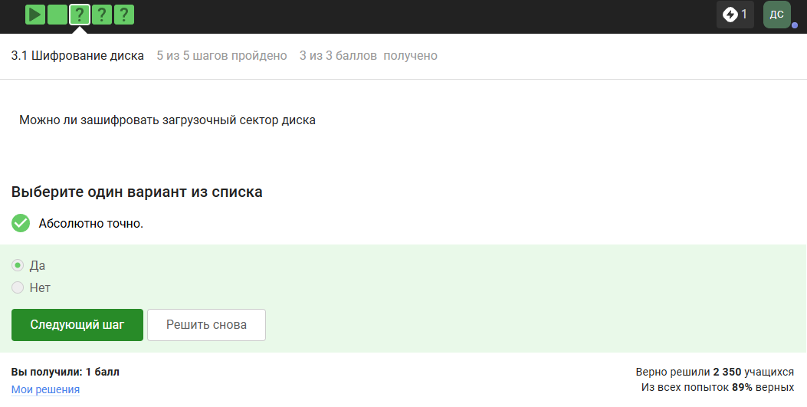{#fig:001 width=70%}

2. Шифрование диска основано на симметричном шифровании, которое обеспечивает быструю работу и подходит для больших объёмов данных.

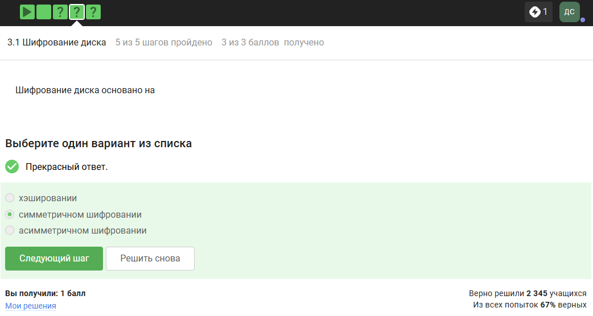{#fig:002 width=70%}

3. Зашифровать жесткий диск можно с помощью BitLocker или VeryCrypt. Wireshark используется для анализа сетевого трафика.

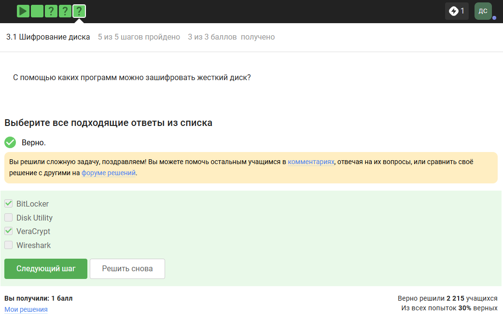{#fig:003 width=70%}

## Пароли

1. Стойким будет пароль `UQr9@j4!S$`, так как он содержит в себе заглавные и строчные буквы, цифры и спецсимволы.

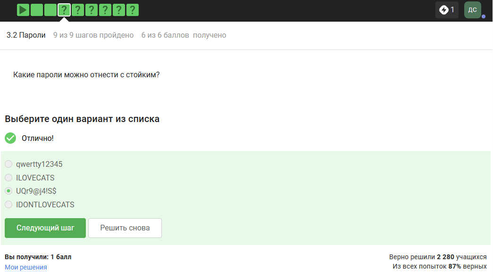{#fig:004 width=70%}

2. Безопаснее всего хранить пароли в менеджерах паролей, которые шифруют их специальным ключом. Остальные методы ненадежны.

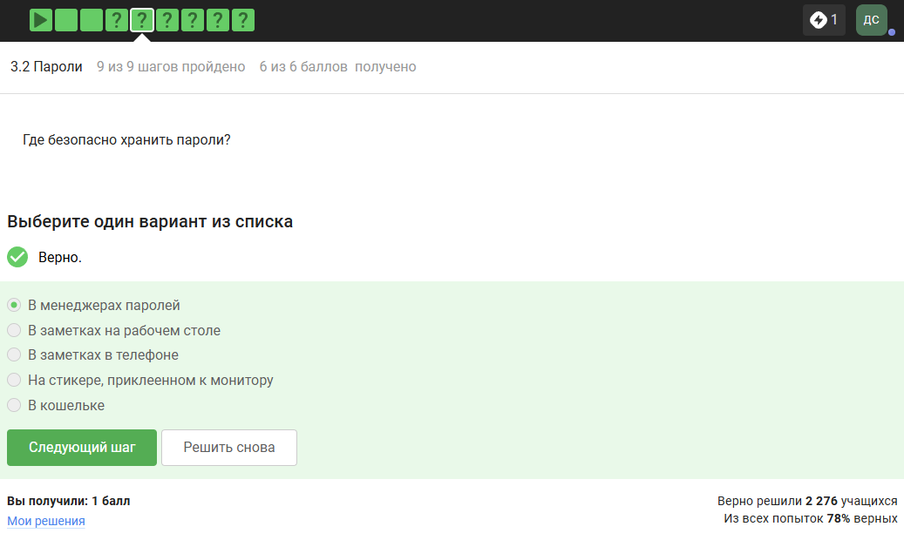{#fig:005 width=70%}

3. Капча защищает от автоматизированных атак, проверяя что действие выполняет человек. Тем самым предотвращается брутфорс, спам и регистрации ботами.

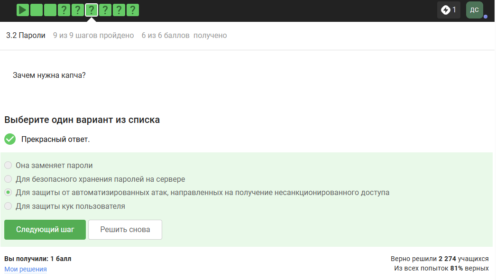{#fig:006 width=70%}

4. Хэширование паролей применяется, чтобы не хранить пароли в открытом виде. Это мешает злоумышленнику сразу прочитать исходные пароли.

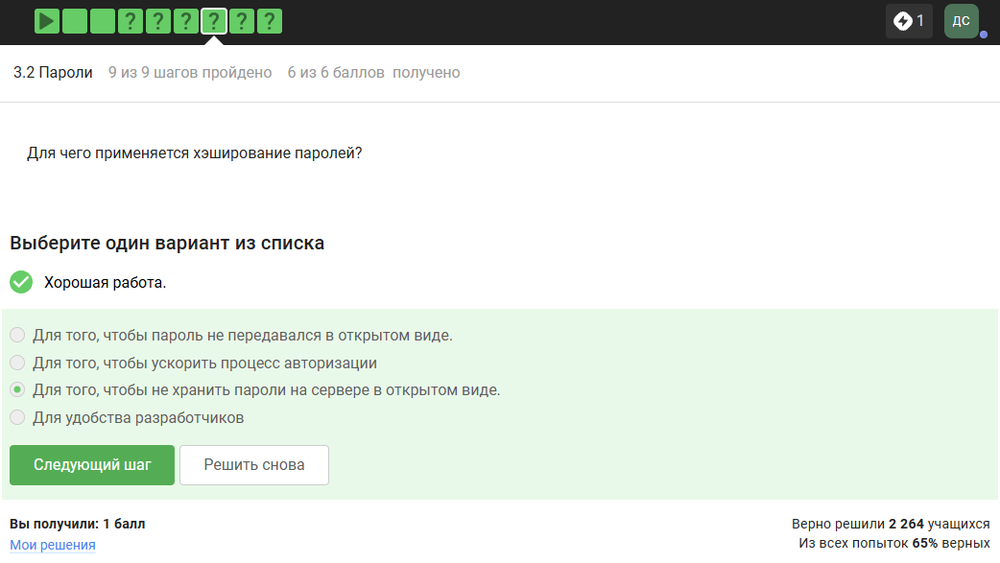{#fig:007 width=70%}

5. Соль действительно улучшает стойкость паролей к атаке перебором, но если злоумышленник уже получил доступ к серверу, то это значит, что он уже вошел в систему, следовательно соль ничем не поможет.

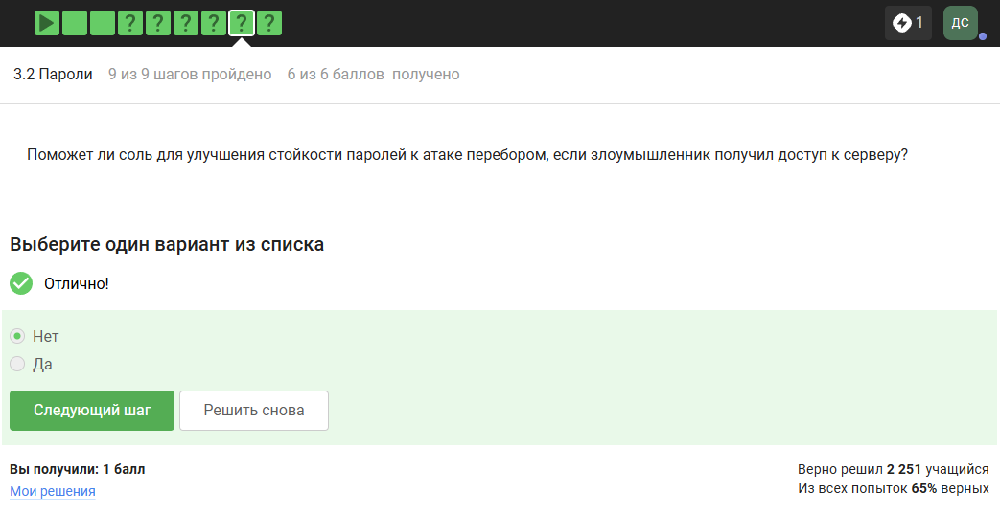{#fig:008 width=70%}

6. Все варианты ответа подходят. Любые меры предосторожности лучше, чем их отсутствие.

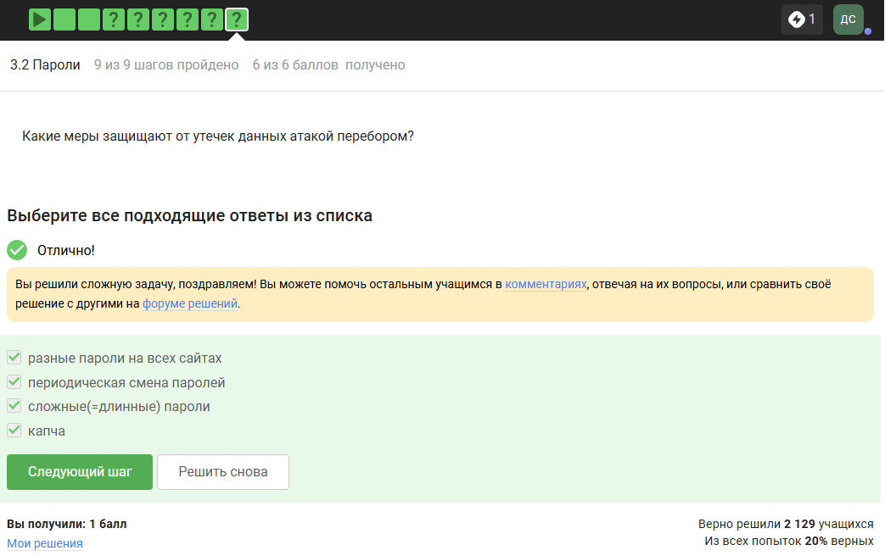{#fig:009 width=70%}

## Фишинг

1. Фишинговые ссылки часто ведут на бесплатные хостинги (wix, ucoz), маскируясь под официальные страницы сайтов, поэтому нужно внимательно смотреть на адрес открываемого сайта.

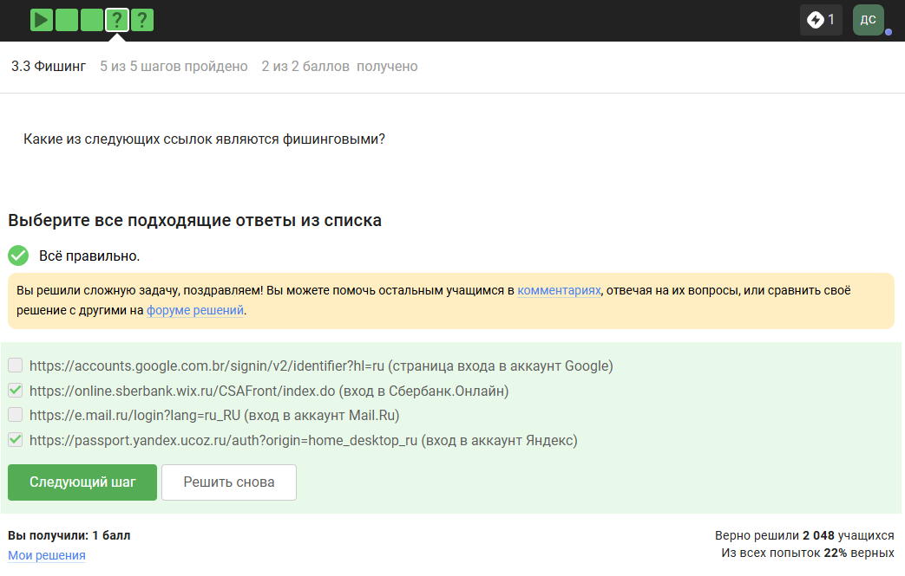{#fig:010 width=70%}

2. Адрес отправителя можно легко подделать (так называемый Email Спуфинг), поэтому соответствующее поле в письме не гарантирует подлинность отправителя.

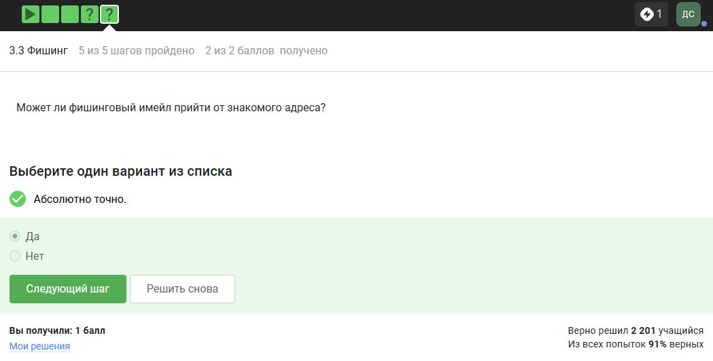{#fig:011 width=70%}

## Вирусы. Примеры

1. Email Спуфинг - это подмена адреса отправителя, при которой злоумышленник указывает чужой адрес в заголовке письма, чтобы вызвать доверие у получателя.

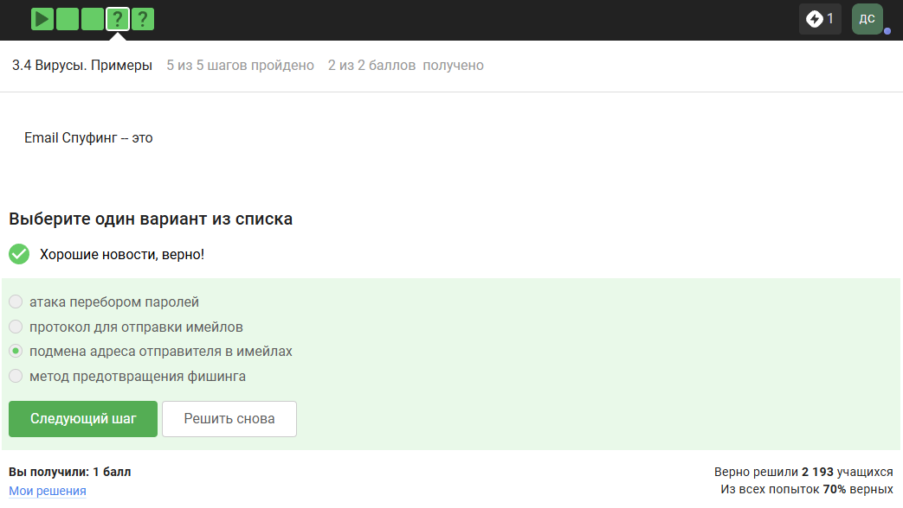{#fig:012 width=70%}

2. В отличие от явных вымогателей или вирусов, троян скрывает свои вредоносные действия, притворяясь полезным приложением.

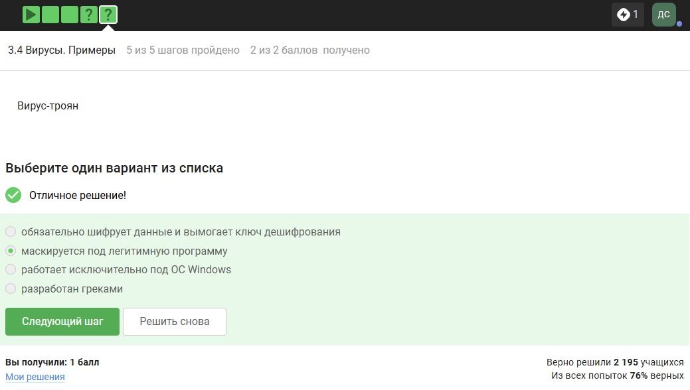{#fig:013 width=70%}

## Безопасноть мессенджеров

1. Ключ шифрования в Signal формируется при генерации первого сообщения отправителем. Начальный сессионный ключ создаётся при первом сообщении, и в дальнейшем ключи обновляются для каждого нового сообщения, но именно стартовый ключ закладывается при отправке первого.

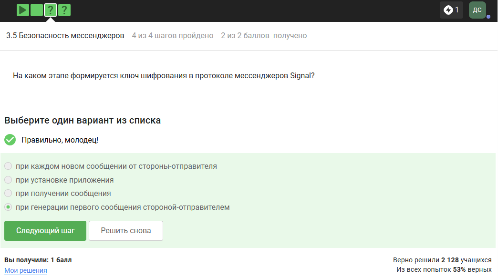{#fig:014 width=70%}

2. Суть сквозного шифрования в том, что сообщения передаются по узлам связи в зашифрованном виде, поэтому сервер не понимает содержание пакета.

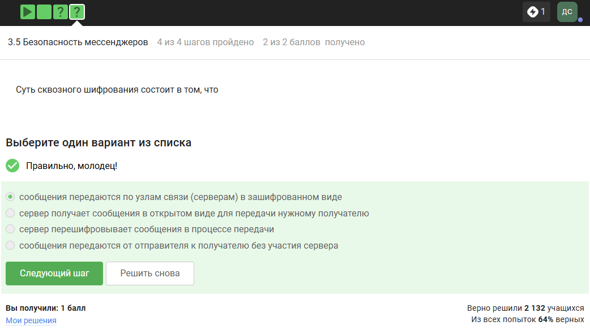{#fig:015 width=70%}

# Вывод

В результате выполнения второго этапа внешнего курса я узнал основные цифровые угрозы и правильное применение паролей, а так же то, как защитить персональный компьютер и телефон от мошеннических атак.

# Список литературы{.unnumbered}

::: {#refs}
:::
