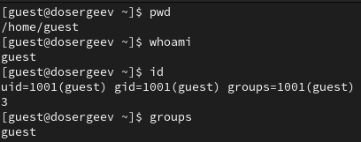

---
## Author
author:
  name: Сергеев Даниил Олегович
  degrees: DSc
  orcid: 0000-0002-0877-7063
  email: 1132246837@rudn.ru
  affiliation:
    - name: Российский университет дружбы народов
      country: Российская Федерация
      postal-code: 117198
      city: Москва
      address: ул. Миклухо-Маклая, д. 6

## Title
title: "Лабораторная работа №2"
subtitle: "Дискреционное разграничение прав в Linux. Основные атрибуты"
license: "CC BY"
---

# Цель работы

Получение практических навыков работы в консоли с атрибутами файлов, закрепление теоретических основ дискреционного разграничения доступа в современных системах с открытым кодом на базе ОС Linux [@tuis].

# Ход выполнения лабораторной работы

## Создание нового пользователя

В установленной при выполнении предыдущей лабораторной работы ОС создадим учётную запись пользователя `guest` и зададим ему пароль.
```bash
useradd guest
passwd guest
```

{#fig:001 width=70%}

Войдем в систему от имени `guest`. Откроем терминал и проверим, в какой директории мы находимся с помощью `pwd`. Сравним с выводом приглашения командной строки. Уточним имя пользователя командой `whoami` и сравним вывод с `id`. Также сравним `id` с выводом `groups`.

{#fig:002 width=70%}

Позиция с `pwd` соответствует домашней директории `/home/guest`, а в приглашении командной строки указан символ `~`, это говорит о том, что мы находимся в домашней директории.

Из команды `id` узнаем следующую информацию:
- `UID=1001(guest)` - номер пользователя и имя.
- `GID=1001(guest)` - основная группа пользователя (номер и имя).
- `groups=1001(guest)` - все группы пользователя.

Имя и группа, полученные с команд `whoami` и `groups`, соответствуют тем, что были получены в команде `id`.

Дополнительно просмотрим файл `/etc/passwd` и найдем в нём свою учётную запись. Определим UID и GID с теми, что были получены в `id`.
```bash
cat /etc/passwd | grep guest
```

{#fig:003 width=70%}

Определим `UID=1001`, `GID=1001`, что полностью соответствует тем значениям, которые находятся в выводе команды `id`.

## Права директории

Определим существующие в системе домашние директории командой
```bash
ls -l /home/
```

Нам удалось вывести список всех директорий в `/home`, они все имеют право на чтение, запись и изменение для владельцев.

Определим, какие расширенные атрибуты установлены на поддиректориях в `/home`:
```bash
lsattr /home
```

Нам удалось увидеть аттрибуты только для директории пользователя `guest`.

{#fig:004 width=70%}

Создадим в домашней директории поддиректорию `dir1` и определим какие права доступа и расширенные атрибуты были выставлены на неё.

{#fig:005 width=70%}

- Права доступа: drwxr-xr-x (755)
- Расширенные аттрибуты отсутствуют

Снимем с директории `dir1` все аттрибуты и проверим правильность выполнения команды:
```bash
chmod 000 dir1
ls -l
```

Попытаемся создать в директории `dir1` файл `file1` командой
```bash
echo "test" > /home/guest/dir1/file1
```

Мы получили отказ. Это произошло, так как у директории `dir1` отсутствуют права на изменение и исполнение. Вернем все права для директории и проверим наличие файла
```bash
chmod 700 dir1
ls -l | grep dir1
ls -l dir1
```

{#fig:006 width=70%}

Заполним таблицы, заданные в лабораторной работе [@tuis]. Проверим каждый из пунктов и отразим результаты в [табл. @tbl-rules1]-[табл. @tbl-rules1-2], [табл. @tbl-rules2].

| Права директории | Права файла     | Создание файла | Удаление файла | Запись в файл | Чтение файла |
|------------------|-----------------|----------------|----------------|---------------|--------------|
|`(000)`           |`(000)`          |-               |-               |-              |-             |
|`(100)`           |`(000)`          |-               |-               |-              |-             |
|`(200)`           |`(000)`          |-               |-               |-              |-             |
|`(300)`           |`(000)`          |+               |+               |-              |-             |
|`(400)`           |`(000)`          |-               |-               |-              |-             |
|`(500)`           |`(000)`          |-               |-               |-              |-             |
|`(600)`           |`(000)`          |-               |-               |-              |-             |
|`(700)`           |`(700)`          |+               |+               |+              |+             |

: Установленные права и разрешённые действия (1) {#tbl-rules1}


| Права директории | Права файла     | Смена директории | Просмотр файлов в директории | Переименование файла| Смена атрибутов файла |
|------------------|-----------------|------------------|------------------------------|---------------------|-----------------------|
|`(000)`           |`(000)`          |                 -|                             -|                    -|                      -|
|`(100)`           |`(000)`          |                 +|                             -|                    -|                      +|
|`(200)`           |`(000)`          |                 -|                             -|                    -|                      -|
|`(300)`           |`(000)`          |                 +|                             -|                    +|                      +|
|`(400)`           |`(000)`          |                 -|                             +|                    -|                      -|
|`(500)`           |`(000)`          |                 +|                             +|                    -|                      +|
|`(600)`           |`(000)`          |                 -|                             +|                    -|                      -|
|`(700)`           |`(700)`          |                 +|                             +|                    +|                      +|

: Установленные права и разрешённые действия (2) {#tbl-rules1-2}

| Операция               | Минимальные права на директорию | Минимальные права на файл |
|------------------------|---------------------------------|---------------------------|
| Создание файла         |`d-wx------ (300)`               |`--------- (000)`          |
| Удаление файла         |`d-wx------ (300)`               |`--------- (000)`          |
| Чтение файла           |`d--x------ (100)`               |`r-------- (400)`          |
| Запись в файл          |`d--x------ (100)`               |`-w------- (200)`          |
| Переименование файла   |`d-wx------ (300)`               |`--------- (000)`          |
| Создание поддиректории |`d-wx------ (300)`               |`--------- (000)`          |
| Удаление поддиректории |`d-wx------ (300)`               |`--------- (000)`          |

: Минимальные права для совершения операций {#tbl-rules2}

# Вывод

В результате выполнения лабораторной работы я получил практические навыки работы в консоли с атрибутами (правами) файлов и каталогов, закрепил теоретические основы дискреционного разграничения доступа в современных системах с открытым кодом на базе ОС Linux, в частности дистр. RedHat Rocky Linux.

# Список литературы{.unnumbered}

::: {#refs}
:::
