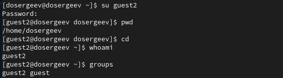
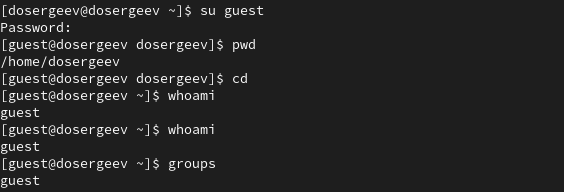
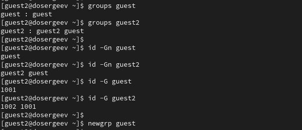
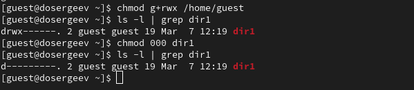

---
## Author
author:
  name: Сергеев Даниил Олегович
  degrees: DSc
  orcid: 0000-0002-0877-7063
  email: 1132246837@rudn.ru
  affiliation:
    - name: Российский университет дружбы народов
      country: Российская Федерация
      postal-code: 117198
      city: Москва
      address: ул. Миклухо-Маклая, д. 6
## Title
title: Лабораторная работа №3
subtitle: Дискреционное разграничение прав в Linux. Два пользователя
license: CC BY
date: today
date-format: "YYYY-MM-DD" # Example: 2025-09-06
---

# Информация

## Докладчик

:::::::::::::: {.columns align=center}
::: {.column width="70%"}

  * Сергеев Даниил Олегович
  * Студент
  * Направление: Прикладная информатика
  * Российский университет дружбы народов
  * [1132246837@pfur.ru](mailto:1132246837@pfur.ru)
  * <https://github.com/FrigatZero>

:::
::::::::::::::

# Цель работы

Получение практических навыков работы в консоли с атрибутами файлов для групп пользователей.

# Ход выполнения лабораторной работы

## Создание нового пользователя

Создадим пользователя `guest2`, как в лабораторной работе №2, и зададим ему пароль. Добавим его в группу `guest`.
```bash
useradd guest2
passwd guest2

gpasswd -a guest2 guest
```

{#fig:001 width=70%}

## Создание нового пользователя

Откроем два терминала и зайдем в них за пользователя `guest` и `guest2`. Проверим, в какой директории мы находимся с помощью `pwd`. Сравним с выводом приглашения командной строки. Уточним имя пользователя и группы командами `whoami` и `groups`.

{#fig:002 width=70%}

## Создание нового пользователя

{#fig:003 width=70%}

## Создание нового пользователя

Позиция с `pwd` равна директории `/home/dosergeev`, из которой мы заходили за guest-пользователей. В приглашении указана директория `dosergeev`, что соответствует выводу команды.

Определим в какие группы входят пользователи `guest` и `guest2`. Сравним вывод двух команд:
```bash
# 1st case
groups guest
groups guest2
# 2nd case (with n)
id -Gn guest
id -Gn guest2
# 2nd case (without n)
id -G guest
id -G guest2
```

## Создание нового пользователя

{#fig:004 width=70%}

## Создание нового пользователя

- Команда `groups` с указанием имени пользователя выводит перечисление всех групп, в которых состоит пользователь. Также указывается имя пользователя перед списком групп;
- Команда `id -G` (с опцией n) выводит все группы в которых состоит пользователь, но без его имени;
- Команда `id -G` (без n) выводит gid всех групп, в которых состоит пользователь.

## Создание нового пользователя

Сравним информацию с `/etc/group`.
```bash
cat /etc/group | tail -n 5
```

{#fig:005 width=70%}

## Создание нового пользователя

Номера `GID=1001`, `GID=1002`, соответствует группам `guest` и `guest2`. В качестве пользователей групп указаны только те, кто не является основным. То есть в группе `guest` отсутствует пользователь `guest`, а в группе `guest2` отсутствует пользователь `guest2` (но находится в группе `guest`).

От имени пользователя `guest2` выполним регистрацию в группе `guest`:
```bash
newgrp guest
```

## Права директории

От имени пользователя `guest` изменим права директории `/home/guest` и снимем все атрибуты с директории `/home/guest/dir1`.
```bash
chmod g+rwx /home/guest
chmod 000 dir1
```

{#fig:006 width=70%}

Заполним таблицы, заданные в лабораторной работе. Проверим каждый из пунктов и отразим результаты.

## Права директории

| Права директории | Права файла     | Создание файла | Удаление файла | Запись в файл | Чтение файла |
|------------------|-----------------|----------------|----------------|---------------|--------------|
|`(000)`           |`(000)`          |-               |-               |-              |-             |
|`(010)`           |`(000)`          |-               |-               |-              |-             |
|`(020)`           |`(000)`          |-               |-               |-              |-             |
|`(030)`           |`(000)`          |+               |+               |-              |-             |
|`(040)`           |`(000)`          |-               |-               |-              |-             |
|`(050)`           |`(000)`          |-               |-               |-              |-             |
|`(060)`           |`(000)`          |-               |-               |-              |-             |
|`(070)`           |`(000)`          |+               |+               |-              |-             |

: Установленные права и разрешённые действия; Права файла (000) (1) {#tbl-rules-000-1}

## Права директории

| Права директории | Права файла     | Смена директории | Просмотр файлов в директории | Переименование файла| Смена атрибутов файла |
|------------------|-----------------|------------------|------------------------------|---------------------|-----------------------|
|`(000)`           |`(000)`          |-                 |-                             |-                    |-                      |
|`(010)`           |`(000)`          |+                 |-                             |-                    |-                      |
|`(020)`           |`(000)`          |-                 |-                             |-                    |-                      |
|`(030)`           |`(000)`          |+                 |-                             |+                    |-                      |
|`(040)`           |`(000)`          |-                 |+                             |-                    |-                      |
|`(050)`           |`(000)`          |+                 |+                             |-                    |-                      |
|`(060)`           |`(000)`          |-                 |+                             |-                    |-                      |
|`(070)`           |`(000)`          |+                 |+                             |+                    |-                      |

: Установленные права и разрешённые действия; Права файла (000) (2) {#tbl-rules1-000-2}

## Права директории

| Права директории | Права файла     | Создание файла | Удаление файла | Запись в файл | Чтение файла |
|------------------|-----------------|----------------|----------------|---------------|--------------|
|`(000)`           |`(020)`          |-               |-               |-              |-             |
|`(010)`           |`(020)`          |-               |-               |+              |-             |
|`(020)`           |`(020)`          |-               |-               |-              |-             |
|`(030)`           |`(020)`          |+               |+               |+              |-             |
|`(040)`           |`(020)`          |-               |-               |-              |-             |
|`(050)`           |`(020)`          |-               |-               |+              |-             |
|`(060)`           |`(020)`          |-               |-               |-              |-             |
|`(070)`           |`(020)`          |+               |+               |+              |-             |

: Установленные права и разрешённые действия; Права файла (020) (1) {#tbl-rules-020-1}

## Права директории

| Права директории | Права файла     | Создание файла | Удаление файла | Запись в файл | Чтение файла |
|------------------|-----------------|----------------|----------------|---------------|--------------|
|`(000)`           |`(040)`          |-               |-               |-              |-             |
|`(010)`           |`(040)`          |-               |-               |-              |+             |
|`(020)`           |`(040)`          |-               |-               |-              |-             |
|`(030)`           |`(040)`          |+               |+               |-              |+             |
|`(040)`           |`(040)`          |-               |-               |-              |-             |
|`(050)`           |`(040)`          |-               |-               |-              |+             |
|`(060)`           |`(040)`          |-               |-               |-              |-             |
|`(070)`           |`(040)`          |+               |+               |-              |+             |

: Установленные права и разрешённые действия; Права файла (040) (1) {#tbl-rules-040-1}

## Права директории

Таблицы схожи с теми, что получены в лабораторной работе №2. Они имеют одно различие:

- Смена атрибутов файла невозможна для пользователя `guest2`, так как он не является владельцем файла.

Составим таблицу минимальных прав для совершения операций.

## Права директории

| Операция               | Минимальные права на директорию | Минимальные права на файл |
|------------------------|---------------------------------|---------------------------|
| Создание файла         |`d----wx--- (030)`               |`--------- (000)`          |
| Удаление файла         |`d----wx--- (030)`               |`--------- (000)`          |
| Чтение файла           |`d-----x--- (010)`               |`---r----- (040)`          |
| Запись в файл          |`d-----x--- (010)`               |`----w---- (020)`          |
| Переименование файла   |`d----wx--- (030)`               |`--------- (000)`          |
| Создание поддиректории |`d----wx--- (030)`               |`--------- (000)`          |
| Удаление поддиректории |`d----wx--- (030)`               |`--------- (000)`          |

: Минимальные права для совершения операций {#tbl-rules2}

# Вывод

В результате выполнения лабораторной работы я получил практические навыки работы в консоли с атрибутами (правами) файлов и каталогов для групп пользователей, закрепил теоретические основы дискреционного разграничения доступа и правила распределения прав групп для файлов и каталогов.
