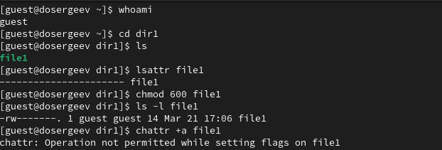
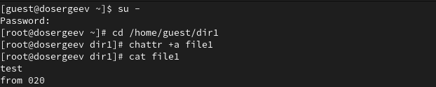
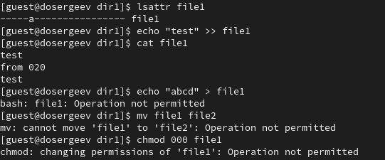
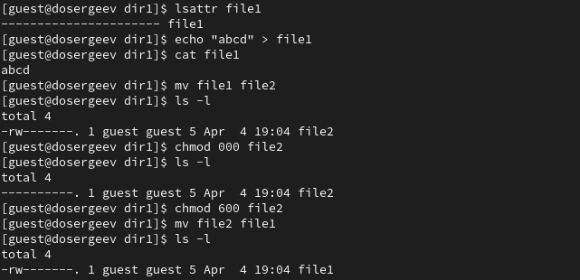
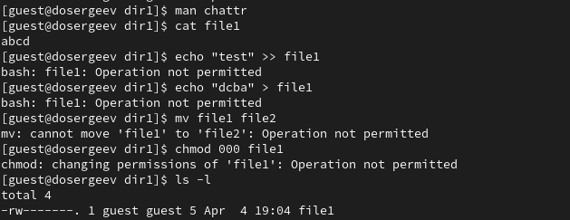
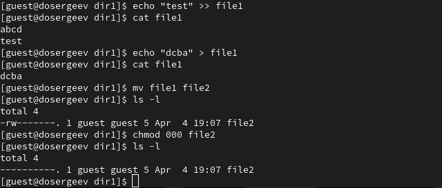

---
## Author
author:
  name: Сергеев Даниил Олегович
  degrees: DSc
  orcid: 0000-0002-0877-7063
  email: kulyabov-ds@rudn.ru
  affiliation:
    - name: Российский университет дружбы народов
      country: Российская Федерация
      postal-code: 117198
      city: Москва
      address: ул. Миклухо-Маклая, д. 6

## Title
title: "Лабораторная работа №4"
subtitle: "Дискреционное разграничение прав в Linux. Расширенные атрибуты"
license: "CC BY"
---

# Цель работы

Получение практических навыков работы в консоли с расширенными атрибутами файлов. [@tuis4]

# Выполнение лабораторной работы

Зайдем в ОС от имени пользователя `guest` и определим расширенные атрибуты файла `file1`, ранее созданного в лабораторных работах №2 и №3 [@tuis3], [@tuis2].
```bash
lsattr /home/guest/dir1/file1
```

Установим право на чтение и запись для владельца файла
```bash
chmod 600 file1
```

{#fig-001 width=70%}

В ответ мы получили отказ на изменение атрибутов.

Зайдем на вторую консоль от имени `root` и попробуем установить атрибут `a` на файл `file1`.
```bash
chattr +a /home/guest/dir1/file1
```

{#fig-002 width=70%}

От пользователя `guest` проверим правильность выполнения предыдущей команды
```bash
lsattr /home/guest/dir1/file1
```

## Операции с атрибутом `a`

Выполним ряд команд для проверки ограничений атрибута `a`.

1. Выполним *дозапись* в файл `file1` с проверкой: 
```bash
echo "test" >> file1
```
2. Выполним *запись* в файл `file1`: 
```bash
echo "abcd" > file1
```
3. Переименуем файл из `file1` в `file2`: 
```bash
mv file1 file2
```
4. Попробуем убрать все права с `file1`: 
```bash
chmod 000 file1
```

{#fig-003 width=70%}

Из введенных команд нам удалось успешно выполнить операцию дозаписи (2), остальные операции не удались.

Снимем расширенный атрибут `a` с файла от имени суперпользователя.
```bash
chattr -a /home/guest/dir1/file1
```

Повторим все четыре операции ещё раз.

{#fig-004 width=70%}

Как мы можем заметить, все операции были успешно выполнены. Если мы посмотрим в справку ```bash man chattr```, то увидим описание атрибута `a`:

       a      A file with the 'a' attribute set can only be opened in
              append mode for writing.  Only the superuser or a process
              possessing the CAP_LINUX_IMMUTABLE capability can set or
              clear this attribute.


Атрибут разрешает *только* открывать файл для дозаписи (`append mode`) для всех пользователей, кроме суперпользователя и обладателя параметра `CAP_LINUX_IMMUTABLE`.

## Операции с атрибутом `i`

Из справки о команде ```bash man chattr``` также узнаем описание атрибута `i`:

       i      A file with the 'i' attribute cannot be modified: it cannot
              be deleted or renamed, no link can be created to this file,
              most of the file's metadata can not be modified, and the
              file can not be opened in write mode.  Only the superuser
              or a process possessing the CAP_LINUX_IMMUTABLE capability
              can set or clear this attribute.


Атрибут запрещает *все* операции по модификации файла для всех пользователей, кроме суперпользователя и обладателя параметра `CAP_LINUX_IMMUTABLE`.

Повторим все четыре действия по шагам, заменив атрибут `a` на `i`.
```bash
chattr +i /home/guest/dir1/file1
```

{#fig-005 width=70%}

Как и ожидалось, мы не смогли дозаписать информацию в файл и провести оставшиеся операции. Теперь попробуем убрать атрибут и снова повторить команды.
```bash
chattr -i /home/guest/dir1/file1
```

{#fig-006 width=70%}

Все операции были успешно выполнены.

# Выводы

Таким образом получим таблицу возможных действий [табл. @tbl-a-i-op] с атрибутами `a` и `i`:

| Атрибут          | `a`     | `i`     |
|------------------|---------|---------|
| Дозапись         | +       | -       |
| Перезапись       | -       | -       | 
| Переименовывание | -       | -       | 
| Изменение прав   | -       | -       | 

: Разрешённые действия `a` и `i` {#tbl-a-i-op}

В результате выполнения лабораторной работы я получил практические навыки работы с расширенными атрибутами файлов, познакомился на примерах с тем, как используются расширенные атрибуты при раграничении доступа, опробовал на практике расширенные атрибуты `i` и `a`.

# Список литературы{.unnumbered}

::: {#refs}
:::
