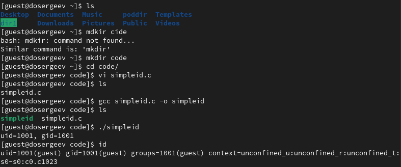
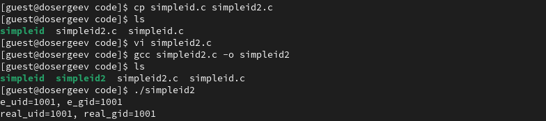
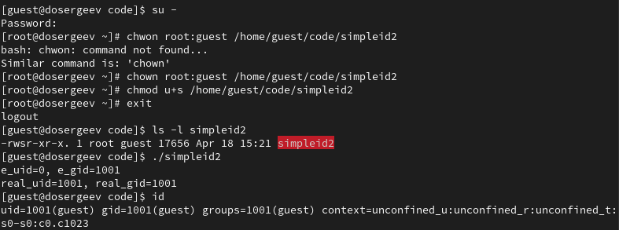
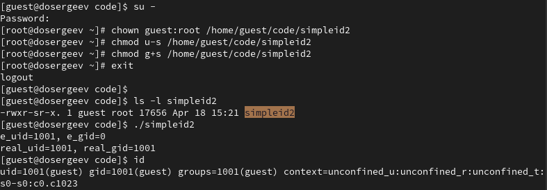
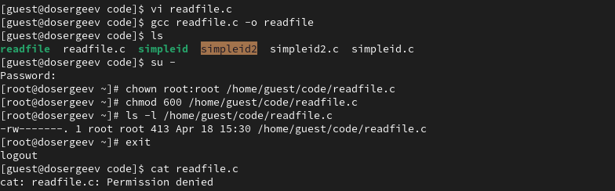
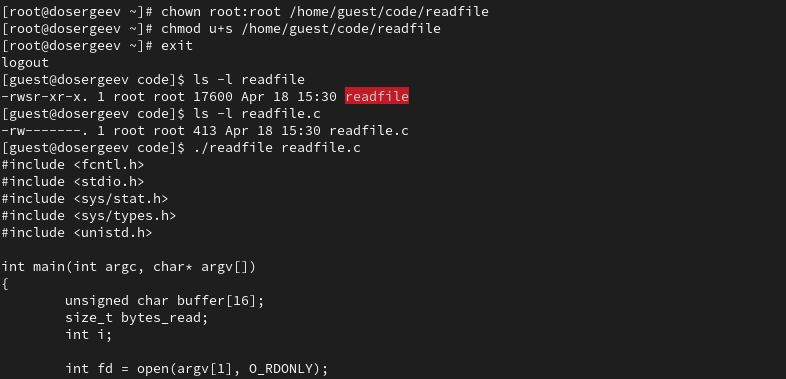
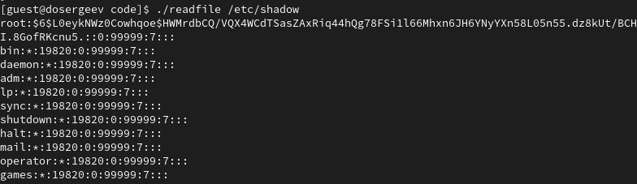
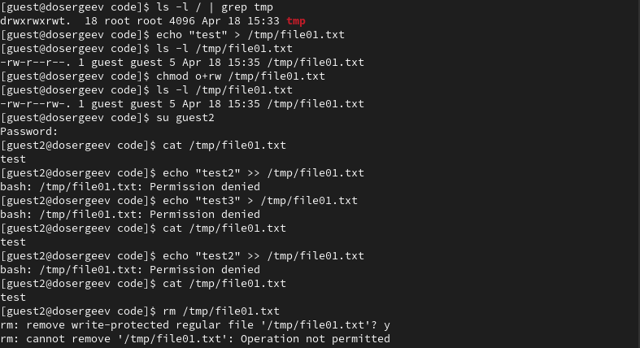
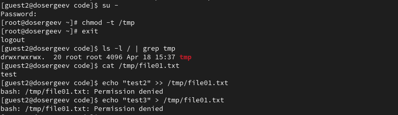
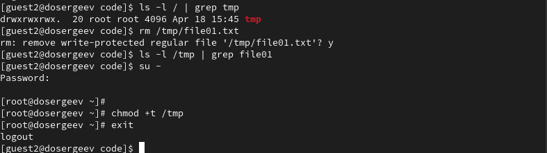

---
## Author
author:
  name: Сергеев Даниил Олегович
  degrees: DSc
  orcid: 0000-0002-0877-7063
  email: kulyabov-ds@rudn.ru
  affiliation:
    - name: Российский университет дружбы народов
      country: Российская Федерация
      postal-code: 117198
      city: Москва
      address: ул. Миклухо-Маклая, д. 6

## Title
title: "Лабораторная работа №5"
subtitle: "Дискреционное разграничение прав в Linux. Исследование влияния дополнительных атрибутов"
license: "CC BY"
---

# Цель работы

Изучение механизмов изменения идентификаторов, применения SetUID- и Sticky-битов. Получение практических навыков работы в консоли с дополнительными атрибутами. Рассмотрение работы механизма смены идентификатора процессов пользователей, а также влияние бита Sticky на запись и удаление файлов. [@tuis]

# Выполнение лабораторной работы

## Создание программы

Войдем в систему от имени пользователя `guest`. Создадим рабочий каталог `code` и создадим в нем программу `simpleid.c`:
```bash
mkdir ~/code
cd code
vi simpleid.c
```

Листинг программы `simpleid.c`
```c
#include <sys/types.h>
#include <unistd.h>
#include <stdio.h>

int main ()
{
    uid_t uid = geteuid();
    gid_t gid = getegid();
    printf ("uid=%d, gid=%d\n", uid, gid);
    return 0;
}
```

Скомпилируем программу и запустим её. Сравним вывод с командой `id`.
```bash
gcc simpleid.c -o simpleid
ls
./simpleid
id
```

В отличие от команды `id`, `simpleid` не выводит информацию о группах текущего пользователя и контекст SELinux. UID и GID текущего пользователя совпадает в выводе команд `id` и `simpleid`.

{#fig-001 width=70%}

Усложним программу. Скопируем файл `simpleid` в `simpleid2` и добавим вывд действительных идентификаторов:
```bash
cp simpleid simpleid2
vi simpleid2
gcc simpleid2.c -o simpleid2
./simpleid2
```

Листинг программы `simpleid2.c`
```c
#include <sys/types.h>
#include <unistd.h>
#include <stdio.h>

int main()
{
    uid_t real_uid = getuid ();
    uid_t e_uid = geteuid ();
    
    gid_t real_gid = getgid ();
    gid_t e_gid = getegid () ;

    printf ("e_uid=%d, e_gid=%d\n", e_uid, e_gid);
    printf ("real_uid=%d, real_gid=%d\n", real_uid, real_gid);
    return 0;
}
```

Скомпилируем и запустим код. Программа вывела два UID и два GID текущего пользователя (действительный и времени исполнения).

{#fig-002 width=70%}

Перейдем в режим суперпользователя и поменяем владельца и группу `simpleid2` на `root:guest`. Добавим `SetUID` бит.
```bash
su -
chown root:guest /home/guest/code/simpleid2
chmod u+s /home/guest/code/simpleid2
exit
```

Выполним проверку правильности установки новых атрибутов и смены владельца файла `simpleid2`. Запустим программу и сравним с `id`:
```bash
ls -l simpleid2
./simpleid2
id
```

{#fig-003 width=70%}

Параметр `e_uid` равен нулю, что говорит нам о том, что файл был запущен от имени суперпользователя. Оставшиеся идентификаторы соответствуют идентификатору группы и пользователя `guest`.
В команде `id` выводятся данные о действительном пользователе, из-за этого она выводит UID и GID для пользователя `guest`, а не `root`.

Повторим те же действия с SetGID-битом.
```bash
su -
chown guest:root /home/guest/code/simpleid2
chmod g+s /home/guest/code/simpleid2
exit

ls -l simpleid2
./simpleid2
id
```

{#fig-004 width=70%}

Теперь только `e_gid` равен нулю, так как файл имеет SetGID-бит и владельца `guest:root`. Аналогично с предыдущим случаем, команда `id` выводит UID и GID пользователя `guest`.

Создадим программу `readfile.c` и откомпилируем её.
```bash
vi readfile.c
gcc readfile.c -o readfile
```

Листинг программы `readfile.c`
```c
#include <fcntl.h>
#include <stdio.h>
#include <sys/stat.h>
#include <sys/types.h>
#include <unistd.h>

int main(int argc, char* argv[])
{
    unsigned char buffer[16];
    size_t bytes_read;
    int i;
    
    int fd = open (argv[1], O_RDONLY);
    do
    {
        bytes_read = read (fd, buffer, sizeof (buffer));
        for (i =0; i < bytes_read; ++i) printf("%c", buffer[i]);
    }
    while (bytes_read == sizeof (buffer));
    
    close (fd);
    return 0;
}
```

Сменим владельца файла readfile.c на `root` и изменим права так, чтобы только он мог прочитать его, a `guest` не мог.
```bash
su -
chown root:root /home/guest/code/readfile.c
chmod 600 /home/guest/code/readfile.c
ls -l /home/guest/code/readfile.c
exit
```

Проверим, что пользователь `guest` не может прочитать файл readfile.c.
```bash
cat readfile.c
```

{#fig-005 width=70%}

Сменим владельца программы `readfile` на `root` и установим SetUID-бит. Проверим, может ли программа прочитать файлы `readfile.c` и `/etc/shadow`.
```bash
su -
chown root:root /home/guest/code/readfile
chmod u+s /home/guest/code/readfile
exit

ls -l readfile
./readfile readfile.c
```

{#fig-006 width=70%}

{#fig-007 width=70%}

Нам удалось прочитать файлы `readfile.c` и `/etc/shadow`, которые доступны только суперпользователю. Это произошло из-за того что `root` стал владельцем программы `readfile`, а сама программа имеет атрибут `SetUID`, позволяющий запускать программу от имени владельца.

## Исследование Sticky-бита

Проверим наличие атрибута Sticky на директории `/tmp`.
```bash
ls -l / | grep tmp
```

От имени пользователя `guest` создадим файл `file01.txt` в `/tmp` со словом test. Разрешим для него чтение и запись для остальных пользователей:
```bash
echo "test" > /tmp/file01.txt
ls -l /tmp/file01.txt
chmod o+rw /tmp/file01.txt
ls -l /tmp/file01.txt
```

Переключимся на пользователя `guest2` и от его имени попробуем

1. прочесть файл `cat /tmp/file01.txt`
2. выполнить дозапись `echo "test2" >> /tmp/file01.txt`
3. выполнить перезапись `echo "test3" > /tmp/file01.txt`
4. удалить файл `rm /tmp/file01.txt`

Для дозаписи и перезаписи выведем содержимое `/tmp/file01.txt` командой `cat /tmp/file01.txt`.

{#fig-008 width=70%}

Из всех команд, ни одна не была выполнена успешно (так как SELinux запрещает изменять временные файлы других пользователей. Если бы SELinux был отключен, не удалась бы только команда удаления файла).

Перейдем на суперпользователя и удалим Sticky-бит.
```bash
su -
chmod -t /tmp
exit
```

Проверим атрибуты каталога `/tmp` и повторим те же действия за пользователя `guest2`.
```bash
ls -l / | grep tmp
cat /tmp/file01.txt
echo "test2" >> /tmp/file01.txt
echo "test3" > /tmp/file01.txt
```

{#fig-009 width=70%}

Операции не удались. Попробуем удалить файл:
```bash
rm /tmp/file01.txt
ls -l /tmp | grep file01
```

Нам удалось удалить файл от имени пользователя `guest2` (владелец файла `guest`). Это произошло так как Sticky-бит был отключен.

Включим обратно Sticky-бит от имени суперпользователя.
```bash
su -
chmod +t /tmp
exit
```

{#fig-010 width=70%}

# Выводы

В результате выполнения лабораторной работы я изучил механизмы изменения идентификаторов SetUID и Sticky, применил их на практике: рассмотрел механизм смены идентификатора процессов пользователей и изучил влияние Sticky-бита на запись и удаление файлов.

# Список литературы{.unnumbered}

::: {#refs}
:::
