---
## Author
author:
  name: Сергеев Даниил Олегович
  degrees: DSc
  orcid: 0000-0002-0877-7063
  email: 1132246837@rudn.ru
  affiliation:
    - name: Российский университет дружбы народов
      country: Российская Федерация
      postal-code: 117198
      city: Москва
      address: ул. Миклухо-Маклая, д. 6
## Title
title: Лабораторная работа №6
subtitle: Мандатное разграничение прав в Linux
license: CC BY
date: today
date-format: "YYYY-MM-DD" # Example: 2025-09-06
---

# Информация

## Докладчик

:::::::::::::: {.columns align=center}
::: {.column width="70%"}

  * Сергеев Даниил Олегович
  * Студент
  * Направление: Прикладная информатика
  * Российский университет дружбы народов
  * [1132246837@pfur.ru](mailto:1132246837@pfur.ru)
  * <https://github.com/FrigatZero>

:::
::::::::::::::

# Цель работы

1. Развить навыки администрирования ОС Linux. Получить первое практическое знакомство с технологией SELinux.
2. Проверить работу SELinux на практике совместно с веб-сервером Apache.

# Выполнение лабораторной работы

Войдем в систему и проверим режим работы и политику SELinux.
```bash
getenforce
sestatus
```

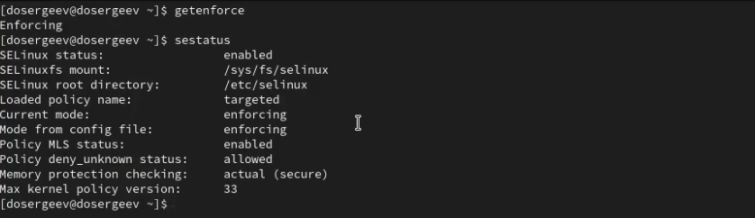{#fig-001 width=70%}

## Выполнение лабораторной работы

Узнаем состояние Apache сервера и запустим его, если он выключен.
```bash
service httpd status
service httpd start
service httpd status
```

## Выполнение лабораторной работы

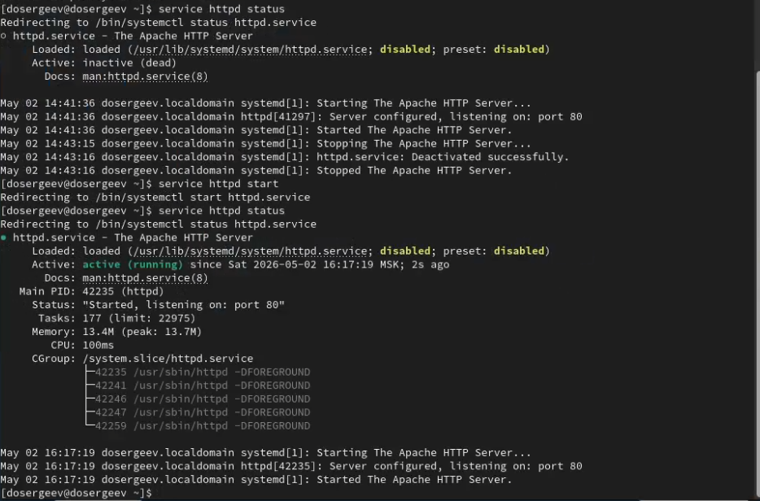{#fig-002 width=70%}

## Выполнение лабораторной работы

Найдем веб-сервер в списке процессов и определим его контекст безопасности
```bash
ps auxZ | grep httpd
```

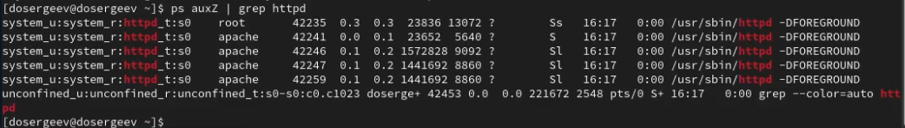{#fig-003 width=70%}

Все службы веб-сервера имеют контекст ```system_u:system_r:httpd_t:s0```.

## Выполнение лабораторной работы

Посмотрим текущее состояние переключателей SELinux для Apache:
```bash
sestatus -b | grep httpd
```

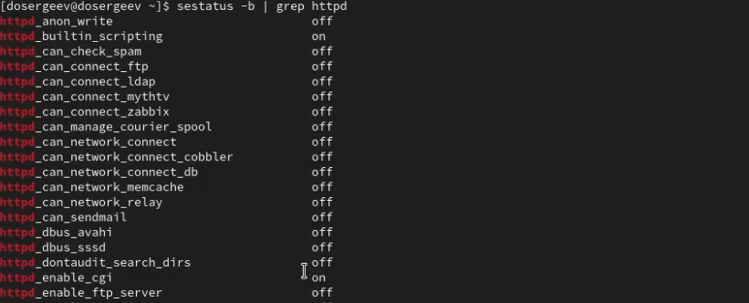{#fig-004 width=70%}

## Выполнение лабораторной работы

Посмотрим статистику по политике с помощью ```seinfo```: множество пользователей, ролей, типов.
```bash
seinfo -u
seinfo -r
seinfo -t | head
```

## Выполнение лабораторной работы

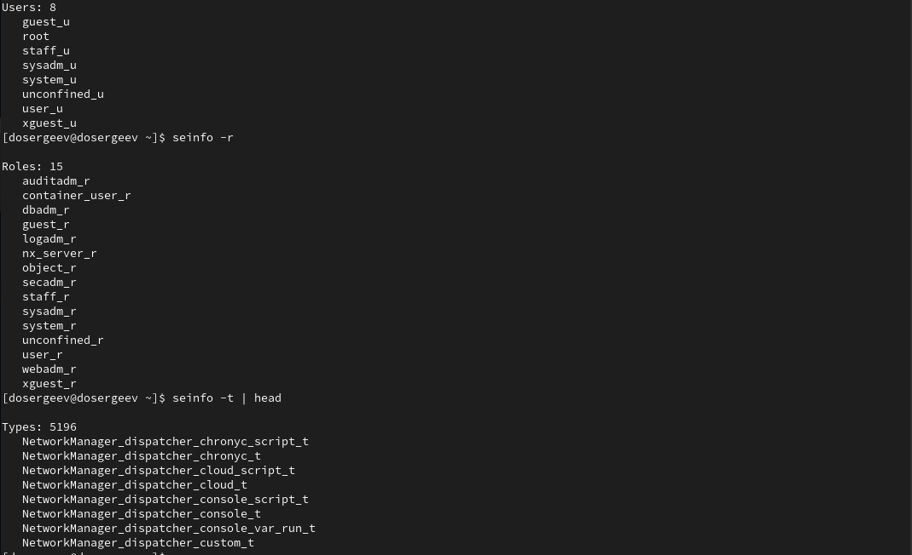{#fig-005 width=70%}

## Выполнение лабораторной работы

Определим тип файлов и поддиректорий, находящихся в ```/var/www```:
```bash
ls -lZ /var/www/
```

В ```/var/www``` находится две пустые директории: ```cgi-bin``` и ```html```. Они имеют типы ```system_u:object_r:httpd_sys_script_exec_t:s0``` и ```system_u:object_r:httpd_sys_content_t:s0``` соответственно. Так как владелец каталогов и его группа root, а другие пользователи имеют право на чтение (r) и исполнение (x), то благодаря контексту httpd создавать файлы в директории может только *суперпользователь* и процессы от его имени.

## Выполнение лабораторной работы

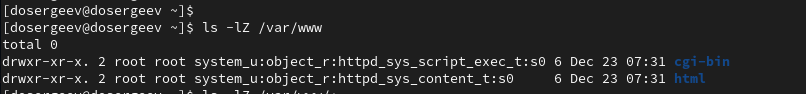{#fig-006 width=70%}

## Выполнение лабораторной работы

Перейдем в режим суперпользователя и создадим файл `test.html` в директории `/var/www/html`.
```html
<html>
<body>test</body>
</html>
```

Проверим контекст по умолчанию для созданного файла. 

## Выполнение лабораторной работы

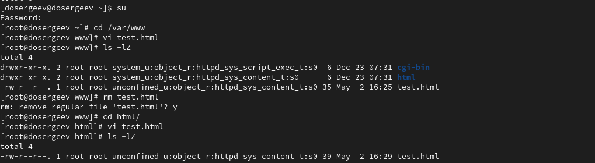{#fig-007 width=70%}

## Выполнение лабораторной работы

Файл имеет по умолчанию контекст
```bash
unconfined_u:object_r:httpd_sys_content_t:s0
```

Перейдем в браузер Firefox и обратимся к файлу по адресу `http://127.0.0.1/test.html`.

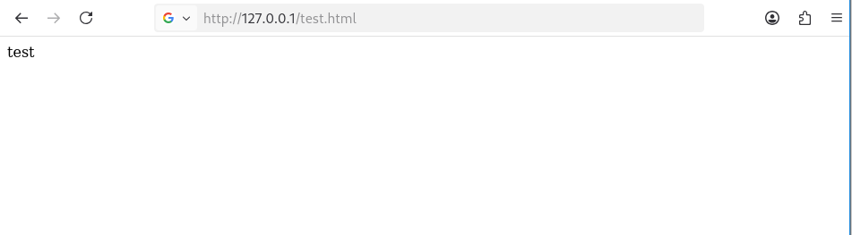{#fig-008 width=70%}

## Выполнение лабораторной работы

Файл успешно отображен. Теперь попробуем изменить контекст файла `test.html`. Изучим справку по контекстам `SELinux` (так как необходимый пакет отсутствует, сначала установим его).
```bash
dnf install selinux-policy-doc
man httpd_selinux
```

## Выполнение лабораторной работы

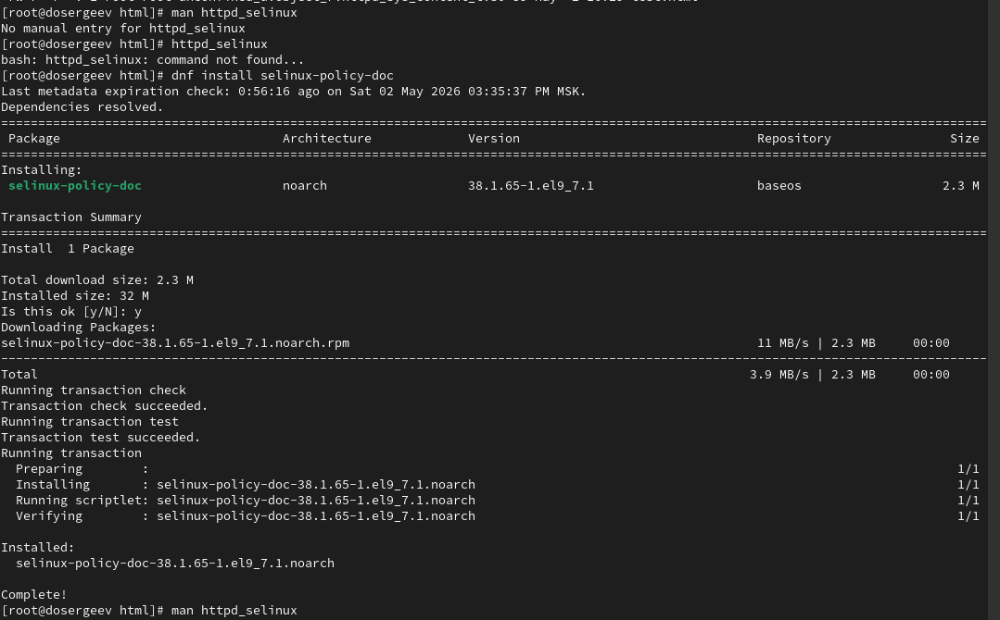{#fig-009 width=70%}

## Выполнение лабораторной работы

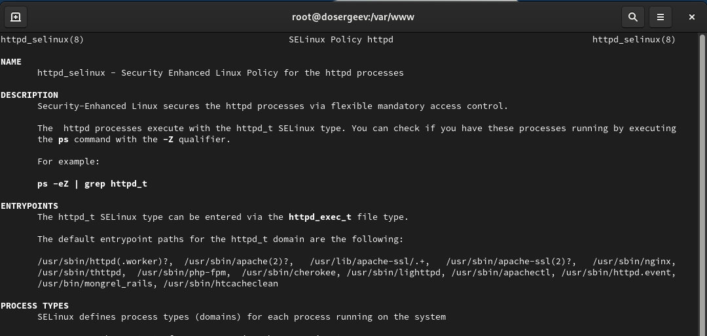{#fig-010 width=70%}

## Выполнение лабораторной работы

Из основных контекстов можно выделить

- `httpd_log_t`
- `httpd_config_t`
- `httpd_sys_content_rw_t`
- `httpd_sys_script_exec_t`
- `httpd_sys_content_t` (соответствует типу `test.html`)

## Выполнение лабораторной работы

Изменим контекст файла `/var/www/html/test.html` c `httpd_sys_content_t` на `samba_share_t`, к которому httpd не должен иметь доступа. Проверим что контекст поменялся.
```bash
ls -lZ
chcon -t samba_share_t test.html
ls -Z test.html
```

Проверим доступ к файлу в браузере.

## Выполнение лабораторной работы

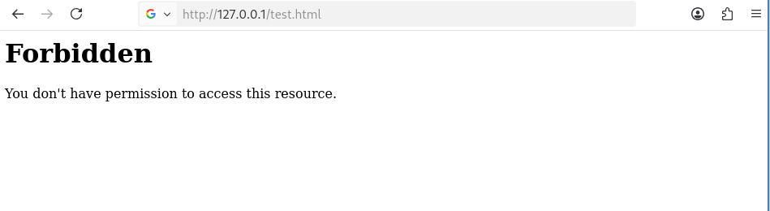{#fig-011 width=70%}

У нас не получилось открыть файл, так как selinux не позволяет прочитать те файлы, у которых отсутствует необходимый контекст из категории `httpd_t`. Просмотрим log-файлы веб-сервера и системный log-файл.

## Выполнение лабораторной работы

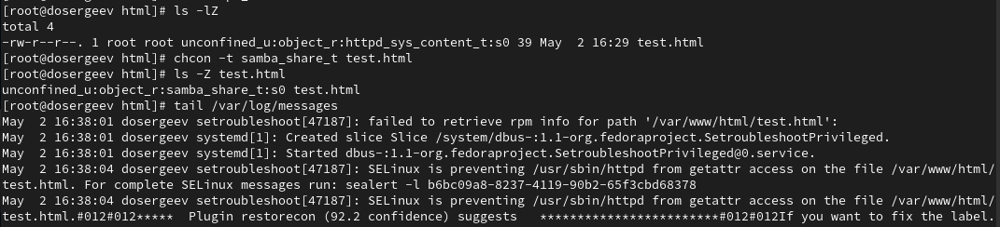{#fig-012 width=70%}

## Выполнение лабораторной работы

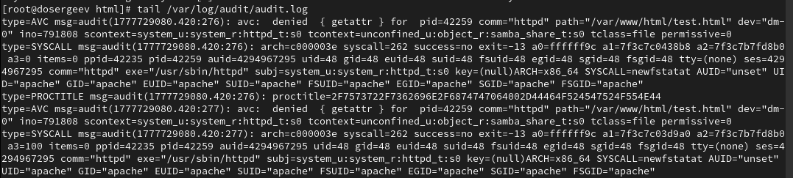{#fig-013 width=70%}

В первом и втором файле выходит сообщение о запрете события `getattr`.

## Выполнение лабораторной работы

Попробуем запустить веб-сервер Apache на прослушивание TCP-порта 81. Для этого откроем файл `/etc/httpd/httpd.conf` и изменим строчку `Listen 80` на `Listen 81`. Перезапустим веб-сервер и проверим статус сервера.
```bash
vi /etc/httpd/conf/httpd.conf
service httpd restart
service httpd status
```

## Выполнение лабораторной работы

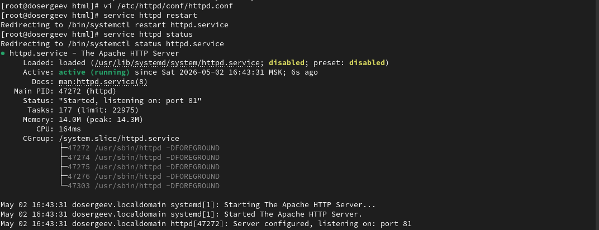{#fig-014 width=70%}

## Выполнение лабораторной работы

Сервер успешно перезапустился, хотя ожидалось, что произойдет сбой. Это произошло, так как порт 81 был добавлен по умолчанию в список доступных портов политики `http_port_t`. Проверим список текущих портов:
```bash
semanage port -l | grep http_port_t
```

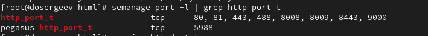{#fig-015 width=70%}

Доступны порты 80, 81, 443, 488, 8008, 8009, 8443, 9000.

## Выполнение лабораторной работы

Попробуем удалить привязку `http_port_t` к 81 порту и удалить файл `test.html`.
```bash
semanage port -d -t http_port_t -p tcp 81
rm test.html
y
ls
```

## Выполнение лабораторной работы

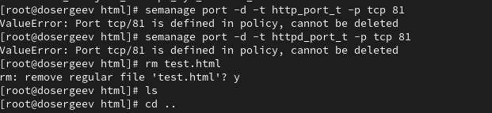{#fig-016 width=70%}

Файл успешно удалился. При попытке удаления привязки к 81 порту выходит ошибка ValueError.

# Выводы

В результате выполнения лабораторной работы я получил практические навыки работы с SELinux, узнал как работает политика безопасности и контексты, проверил работу SELinux на примере веб-сервера Apache.
