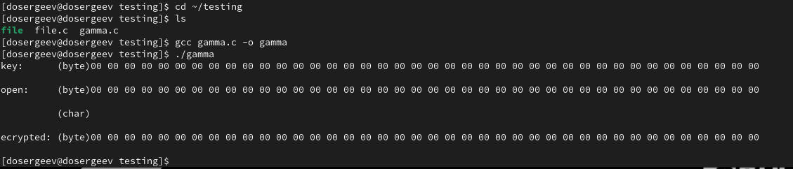
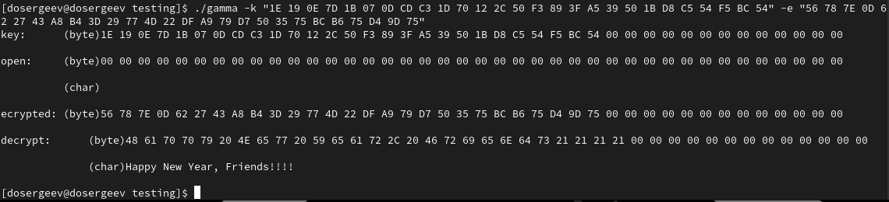

---
## Author
author:
  name: Сергеев Даниил Олегович
  degrees: DSc
  orcid: 0000-0002-0877-7063
  email: 1132246837@rudn.ru
  affiliation:
    - name: Российский университет дружбы народов
      country: Российская Федерация
      postal-code: 117198
      city: Москва
      address: ул. Миклухо-Маклая, д. 6
## Title
title: Лабораторная работа №7
subtitle: Элементы криптографии. Однократное гаммирование
license: CC BY
date: today
date-format: "YYYY-MM-DD" # Example: 2025-09-06
---

# Информация

## Докладчик

:::::::::::::: {.columns align=center}
::: {.column width="70%"}

  * Сергеев Даниил Олегович
  * Студент
  * Направление: Прикладная информатика
  * Российский университет дружбы народов
  * [1132246837@pfur.ru](mailto:1132246837@pfur.ru)
  * <https://github.com/FrigatZero>

:::
::::::::::::::

# Цель работы

Освоить на практике применение режима однократного гаммирования.

# Выполнение лабораторной работы

Войдем в систему и создадим файл программы на языке C в каталоге `~/testing`. Назовем его `gamma.c`.
```bash
cd ~/testing
vi gamma.c
```

Будем принимать ключ, открытый текст и шифротекст через аргументы программы:

- Опция `-k` : ключ в hex формате
- Опция `-o` : открытый текст в hex формате
- Опция `-e` : шифротекст в hex формате
- Формат: `00 01 02 ... 1F 2F ...`

Для удобства будем использовать байт-буфферы фиксированного размера. Сложение по модулю будем применять для всех элементов двух массивов.

## Выполнение лабораторной работы

На выход программа будет выводить введенные данные (открытый текст будет отображен в символьном и в шестнадцатеричном формате). В зависимости от входных аргументов:

- Если есть ключ и открытый текст (`new_text`, `test_decrypt`): будет выводится шифротекст, полученный путем применения сложения по модулю ключа и текста;
- Если есть шифротекст и ключ (`decrypt`): будет выводится расшифровка шифротекста (в байтах и в строчном виде);
- Если есть шифротекст и открытый текст (`desired_key`): будет выводится ключ, необходимый для преобразования шифротекста в приведенный открытый текст.

## Выполнение лабораторной работы

Скомпилируем программу и проведем пробный запуск.
```bash
cd ~/testing
ls
gcc gamma.c -o gamma
./gamma
```

{#fig-001 width=70%}

## Выполнение лабораторной работы

{#fig-002 width=70%}

Проверка ключа показывает, что мы правильно создали шифротекст.
Теперь попробуем создать ключ для открытого текста `Happy New Year, Friends!!!!` и зашифрованного текста, полученного ранее.

## Выполнение лабораторной работы

{#fig-003 width=70%}

## Выполнение лабораторной работы

{#fig-004 width=70%}

Фраза расшифровалась правильно.

## Выполнение лабораторной работы

{#fig-005 width=70%}

## Выполнение лабораторной работы

{#fig-006 width=70%}

Теперь Центр получит сообщение `Stirlitz - You are a Hero!!`, а Мюллер - `Stirlitz - You are a Fool!!`.

# Ответы на контрольные вопросы

1. Поясните смысл однократного гаммирования.

- Однократное гаммирование - это наложение (снятие) на открытые (зашифрованные) данные последовательности элементов других данных, которое использует однократную вероятностную гамму той же длины, что и подлежащий сокрытию текст.

2. Перечислите недостатки однократного гаммирования.

- Необходимость в полной случайности ключа `TRNG`;
- Если злоумышленник знает часть исходного текста и соответствующую шифрограмму, то текст можно расшифровать;
- Использование одной и той же гаммы на разные тексты снижает уровень защиты.

## Ответы на контрольные вопросы

3. Перечислите преимущества однократного гаммирования.

- Даже при раскрытии части последовательности гаммы нельзя получить информацию о всём скрываемом тексте;
- Криптоалгоритм не даёт никакой информации об открытом тексте;
- Вычислительная эффективность.

4. Почему длина открытого текста должна совпадать с длиной ключа?

- В противном случае, нарушается абсолютная стойкость шифротекста. Шифр становится уязвим для частотного анализа и других атак.

## Ответы на контрольные вопросы

5. Какая операция используется в режиме однократного гаммирования, назовите её особенности?

- Применяется операция XOR (исключающее ИЛИ, сложение по модулю 2), её особенность в том, что двойное прибавление одной и той же величины восстанавливает исходное значение, также шифрование и расшифрование выполняется одной и той же программой.

## Ответы на контрольные вопросы

6. Как по открытому тексту и ключу получить шифротекст?

- Применить операцию XOR между последовательностями символов текста и ключа.

7. Как по открытому тексту и шифротексту получить ключ?

- Применить операцию XOR между последовательностями символов текста и шифротекста.

8. В чем заключаются необходимые и достаточные условия абсолютной стойкости шифра?

- Полная случайность ключа;
- Равенство длин ключа и открытого текста;
- Однократное использование ключа.

# Выводы

В результате выполнения лабораторной работы я самостоятельно написал программу, выполняющую однократное гаммирование на заданных примерах. Она способна шифровать сообщение по ключу и открытому тексту, дешифровать по ключу и шифротексту, создавать новый ключ на основе шифротекста и открытого текста. Я на практике освоил одну из простых, но надежных схем шифрования данных.
