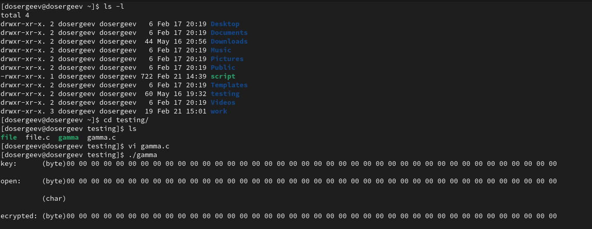
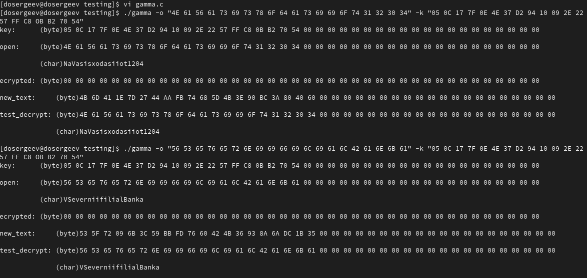
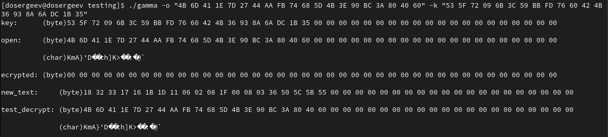
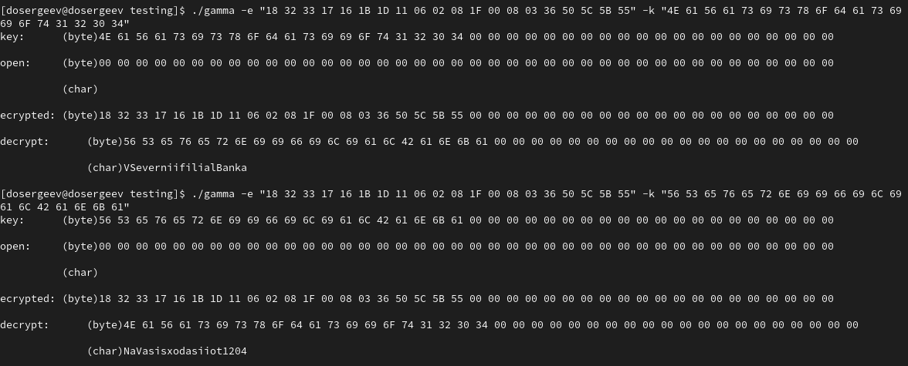
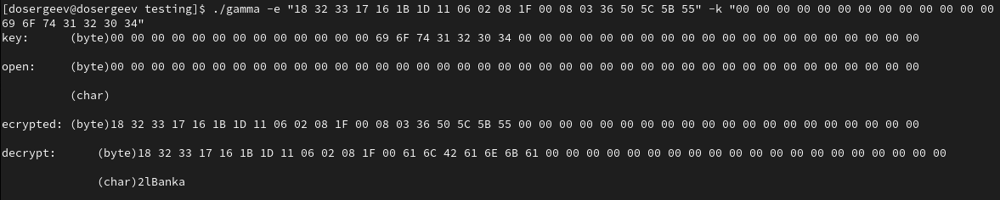
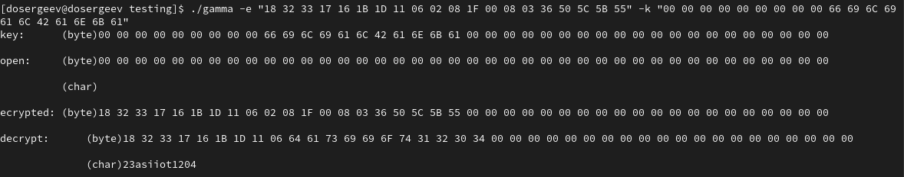
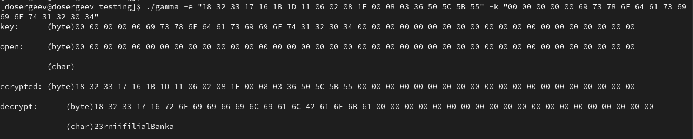
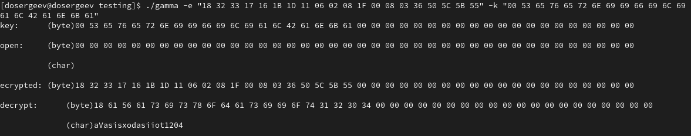
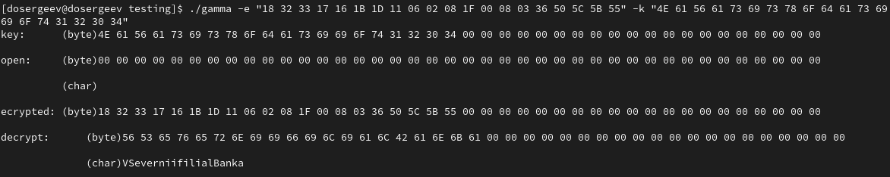

---
## Author
author:
  name: Сергеев Даниил Олегович
  degrees: DSc
  orcid: 0000-0002-0877-7063
  email: kulyabov-ds@rudn.ru
  affiliation:
    - name: Российский университет дружбы народов
      country: Российская Федерация
      postal-code: 117198
      city: Москва
      address: ул. Миклухо-Маклая, д. 6

## Title
title: "Лабораторная работа №8"
subtitle: "Элементы криптографии. Шифрование (кодирование) различных исходных текстов одним ключом"
license: "CC BY"
---

# Цель работы

Освоить на практике применение режима однократного гаммирования на примере кодирования различных исходных текстов одним ключом. [@tuis]

# Выполнение лабораторной работы

Воспользуемся программой `gamma`, написанной в предыдущей лабораторной работе, так как она удовлетворяет требованиям работы. Запустим программу для проверки.
```bash
ls -l
cd ~/testing
./gamma
```

Будем принимать ключ, открытый текст и шифротекст через аргументы программы:

- Опция `-k` : ключ в hex формате
- Опция `-o` : открытый текст в hex формате
- Опция `-e` : шифротекст в hex формате
- Формат: `00 01 02 ... 1F 2F ...`

На выход программа выводит введенные данные (открытый текст отображен в символьном и в шестнадцатеричном формате). В зависимости от входных аргументов:

- Если есть ключ и открытый текст (`new_text`, `test_decrypt`): выводится шифротекст, полученный путем применения сложения по модулю ключа и текста;
- Если есть шифротекст и ключ (`decrypt`): выводится расшифровка шифротекста (в байтах и в строчном виде);
- Если есть шифротекст и открытый текст (`desired_key`): выводится ключ, необходимый для преобразования шифротекста в приведенный открытый текст.

Листинг №1. Код программы
```c
#include <stdio.h>
#include <string.h>
#include <locale.h>
#include <stdbool.h>

#define MAX_BUFFER_SIZE 40
typedef unsigned char byte;


void char_2_hex(const char c, byte *val)
{
	if ((c >= '0') && (c <= '9'))
		*val = (byte)(c - '0');
	else if ((c >= 'a') && (c <= 'f'))
		*val = (byte)(c - 'a') + 10;
	else if ((c >= 'A') && (c <= 'F'))
		*val = (byte)(c - 'A') + 10;
}

void read_bytes(byte *buffer, char *data) 
{	
	int i = 0, j = 0;
	while (data[i] != '\0')
	{
		byte left = 0;
		byte right = 0;


		char_2_hex(data[i], &left);
		char_2_hex(data[i + 1], &right);

		
		buffer[j] = (left << 4) | (right & 0x0f);
		if (data[i + 2] == '\0') break;
		i += 3; j++;
	}
}

void print_as_bytes(byte *buffer)
{
	for (int i = 0; i < MAX_BUFFER_SIZE; i++)
	{
		printf("%02X ", buffer[i]);
	}
	printf("\n");
}
void print_as_chars(byte *buffer)
{
	for (int i = 0; i < MAX_BUFFER_SIZE; i++)
	{
		printf("%c", buffer[i]);
	}
	printf("\n");
}

void xor(byte *buffer, byte *open, byte *key) {
	for (int i = 0; i < MAX_BUFFER_SIZE; i++)
	{
		buffer[i] = open[i] ^ key[i];
	}
}

int main(int argc, char **argv) 
{
	byte       key[MAX_BUFFER_SIZE] = { 0 };
	byte      open[MAX_BUFFER_SIZE] = { 0 };
	byte encrypted[MAX_BUFFER_SIZE] = { 0 };

	bool hasKey = false;
	bool hasOpen = false;
	bool hasEncrypted = false;

	int i = 1;
	while (i < argc)
	{
		if (strcmp(argv[i], "-k") == 0) {
			if (i + 1 < argc) 
			{
				read_bytes(key, argv[i + 1]);
				hasKey = true;
			}
		}
		else if (strcmp(argv[i], "-o") == 0) {
			if (i + 1 < argc)
			{
				read_bytes(open, argv[i + 1]);
				hasOpen = true;
			}
		}
		else if (strcmp(argv[i], "-e") == 0) {
			if (i + 1 < argc)
			{
				read_bytes(encrypted, argv[i + 1]);
				hasEncrypted = true;
			}
		}
		i++;
	}

	printf("key:      (byte)"); 
	print_as_bytes(key); printf("\n");
	printf("open:     (byte)"); 
	print_as_bytes(open); printf("\n");
	printf("          (char)"); 
	print_as_chars(open); printf("\n");
	printf("ecrypted: (byte)"); 
	print_as_bytes(encrypted); printf("\n");

	byte buffer[MAX_BUFFER_SIZE] = { 0 };
	if (hasOpen && hasKey) {
		xor(buffer, open, key);
		printf("new_text:     (byte)"); 
		print_as_bytes(buffer); printf("\n");
		xor(buffer, buffer, key);
		printf("test_decrypt: (byte)"); 
		print_as_bytes(buffer); printf("\n");
		printf("              (char)"); 
		print_as_chars(buffer); printf("\n");
	}
	if (hasEncrypted && hasKey) {
		xor(buffer, encrypted, key);
		printf("decrypt:      (byte)"); 
		print_as_bytes(buffer); printf("\n");
		printf("              (char)"); 
		print_as_chars(buffer); printf("\n");
	}
	if (hasEncrypted && hasOpen) {
		xor(buffer, encrypted, open);
		printf("desired_key:  (byte)"); 
		print_as_bytes(buffer); printf("\n");	
	}
}
```

{#fig-001 width=70%}

Сначала зашифруем два исходных сообщения (для удобства будем использовать латиницу): NaVasisxodasiiot1204(НаВашисходящийот1204), VSeverniifilialBanka(ВСеверныйфилиалБанка).

Первое сообщение:

- Текст:     4E 61 56 61 73 69 73 78 6F 64 61 73 69 69 6F 74 31 32 30 34
-            (`NaVasisxodasiiot1204`)
- Ключ:      05 0C 17 7F 0E 4E 37 D2 94 10 09 2E 22 57 FF C8 OB B2 70 54
- Результат: 4B 6D 41 1E 7D 27 44 AA FB 74 68 5D 4B 3E 90 BC 3A 80 40 60

Второе сообщение:

- Текст:     56 53 65 76 65 72 6E 69 69 66 69 6C 69 61 6C 42 61 6E 6B 61
-            (`VSeverniifilialBanka`)
- Ключ:      05 0C 17 7F 0E 4E 37 D2 94 10 09 2E 22 57 FF C8 OB B2 70 54
- Результат: 53 5F 72 09 6B 3C 59 BB FD 76 60 42 4B 36 93 8A 6A DC 1B 35

{#fig-002 width=70%}

Теперь сложим оба шифротекста по модулю 2. Получим комбинацию двух шифровок, равносильную комбинации двух открытых текстов.

{#fig-003 width=70%}

Не зная ключа, прочитаем оба текста. Допустим, нам известно одно сообщение-шаблон: `NaVasisxodasiiot1204`. Используем его в качестве ключа для зашифрованного текста, полученного ранее.

{#fig-004 width=70%}

Применив раскрытое сообщение к шифротексту, получим сообщение-шаблон.

Рассмотрим способ, при котором злоумышленник может прочитать оба текста, не зная ключа и не стремясь его определить.
Злоумышленнику достаточно знать часть шаблона, чтобы определить те символы второго сообщения, которые находятся на позициях известного шаблона. Если в сообщении можно распознать логику, то, подставляя потенциально возможные слова или их комбинации (шаблона или сообщения), злоумышленник получает реальный шанс узнать ещё некоторое количество символов искомого сообщения. Таким образом, злоумышленник либо полностью прочитает сообщение, либо значительно уменьшит пространство поиска.

Пусть мы знаем часть шаблона: `ot1024`. Подставив её к шифротексту, мы получим `lBanka`. Можно предположить, что перед словом Банк стоит слово Филиал - подставим и проверим: `odasiiot1204`. Так как мы получили осмысленный текст, предположение оказалось верным. Продолжая цепочку рассуждений мы прийдем к разгадке и расшифруем всё сообщение.

{#fig-005 width=70%}

{#fig-006 width=70%}

{#fig-007 width=70%}

{#fig-008 width=70%}

{#fig-009 width=70%}

# Ответы на контрольные вопросы

1. Как, зная один из текстов (P1 или P2), определить другой, не зная при этом ключа?

- Зная один открытый текст и оба шифротекста, можно вычислить второй открытый текст через XOR: `P2 = C1 XOR C2 XOR P1`, поскольку при повторном использовании ключа K справедливо `C1 = P1 XOR K, C2 = P2 XOR K`.

2. Что будет при повторном использовании ключа при шифровании текста?

- При повторном использовании ключа на шифротексте, мы его расшифруем.

3. Как реализуется режим шифрования однократного гаммирования одним ключом двух открытых текстов?

- Реализуется путём наложения одной и той же гаммы на каждый открытый текст отдельно, формируя два шифротекста.

4. Перечислите недостатки шифрования одним ключом двух открытых текстов.

- Потеря информационной стойкости;
- Возможность восстановления обоих текстов.

5. Перечислите преимущества шифрования одним ключом двух открытых текстов.

- Упрощенное управления ключами;

# Выводы

В результате выполнения лабораторной работы я на практике узнал все преимущества и недостатки однократного гаммирования на примере кодирования различных исходных текстов одним ключом

# Список литературы{.unnumbered}

::: {#refs}
:::
