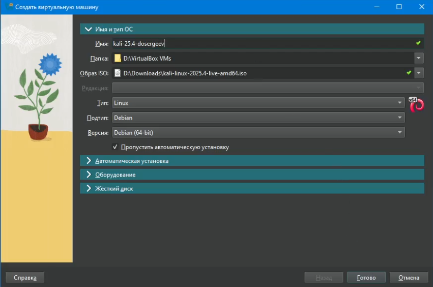
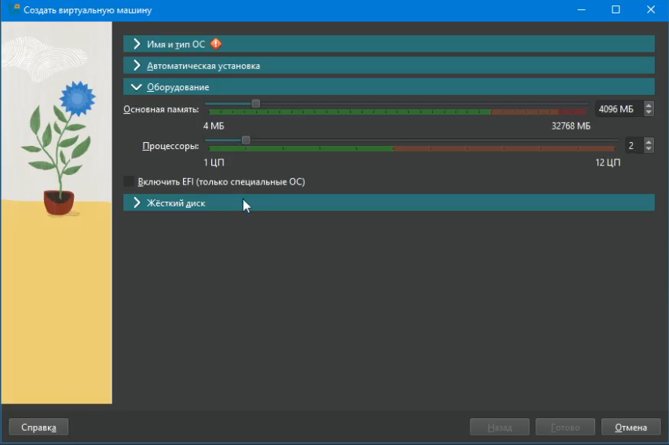
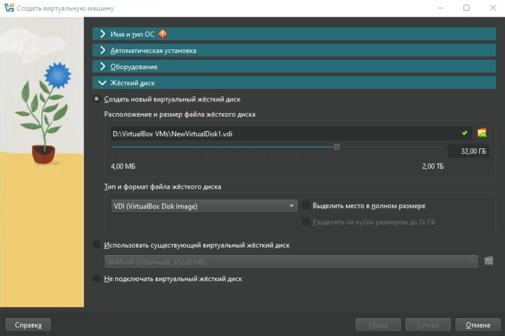
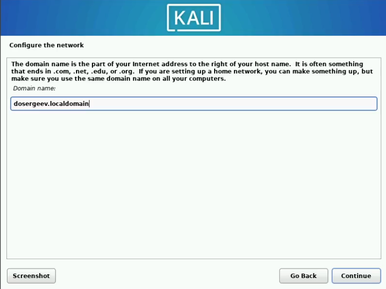
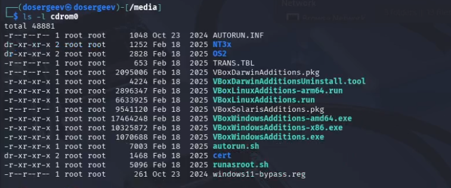
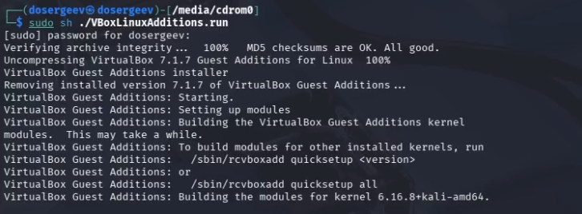
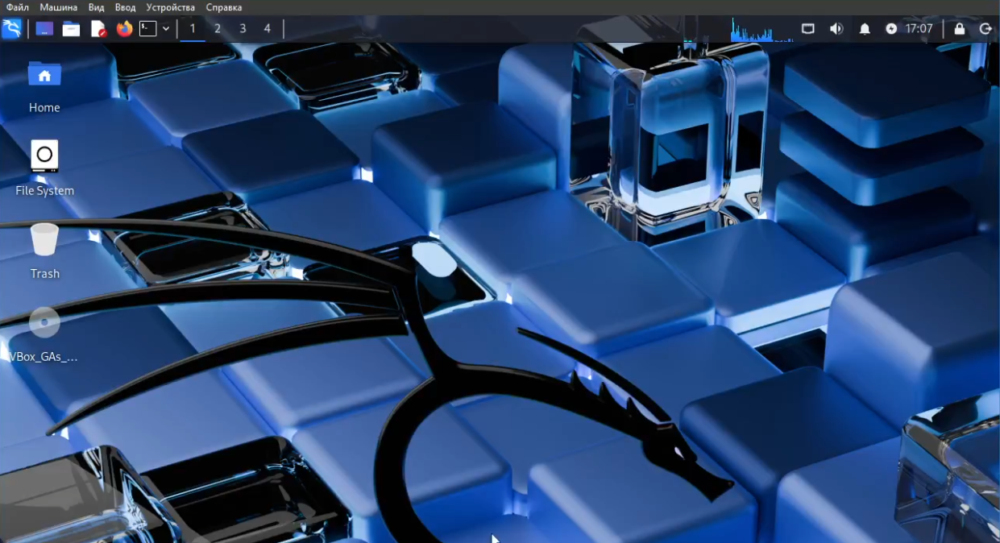

---
## Author
author:
  name: Сергеев Даниил Олегович
  degrees: DSc
  orcid: 0000-0002-0877-7063
  email: 1132246837@rudn.ru
  affiliation:
    - name: Российский университет дружбы народов
      country: Российская Федерация
      postal-code: 117198
      city: Москва
      address: ул. Миклухо-Маклая, д. 6

## Title
title: "Индивидуальный проект"
subtitle: "Этап №1"
license: "CC BY"
---

# Цель работы

Целью данной работы является настройка минимально необходимых сервисов для дальнейшего выполнения индивидуального проекта. [@tuis], [@kali-book]

# Ход выполнения лабораторной работы

## Создание виртуальной машины

Откроем менеджер виртуальных машин Oracle VirtualBox и нажмем на кнопку создать в графическом интерфейсе. Выберем тип машины Linux, подтип Debian (64-bit). Зададим имя, удовлетворяющее соглашению о наименовании. Укажем образ Kali Linux.

{#fig:001 width=70%}

Выделим размер основной памяти виртуальной машины до 4096 МБ и 2 процессора.

{#fig:002 width=70%}

Для жёсткого диска выделим 32 ГБ, выберем тип VDI.

{#fig:003 width=70%}

## Установка операционной системы

Запустим ОС. После запуска нас встречает графический установщик операционной системы

{#fig:004 width=70%}

Поставим язык English в качестве основного в ОС. В качестве дополнительного поставим русский язык.

В настройках сети в качестве домена укажем dosergeev.localdomain.

{#fig:005 width=70%}

Установим пользователя, по соглашению о наименовании, и пароль. Зададим локального пользователя с правами администратора и пароль.

Начнем установку ОС. После её завершения корректно перезагрузим ОС. Подключим образ гостевой ОС и начнем установку. После неё снова перезагрузим Kali Linux.

{#fig:006 width=70%}

{#fig:007 width=70%}

Операционная система установлена.

{#fig:008 width=70%}

# Вывод

В результате выполнения лабораторной работы я приобрел навыки установки операционной системы на виртуальную машину и минимально настроил операционную систему Kali Linux для дальнейшего выполнения индивидуального проекта.

# Список литературы{.unnumbered}

::: {#refs}
:::
