---
## Author
author:
  name: Сергеев Даниил Олегович
  degrees: DSc
  orcid: 0000-0002-0877-7063
  email: 1132246837@rudn.ru
  affiliation:
    - name: Российский университет дружбы народов
      country: Российская Федерация
      postal-code: 117198
      city: Москва
      address: ул. Миклухо-Маклая, д. 6

## Title
title: "Индивидуальный проект"
subtitle: "Этап №2"
license: "CC BY"
---

# Цель работы

Целью данной работы является установка Damn Vulnerable Web Application (DVWA) в гостевую систему Kali Linux. [@tuis], [@kali-book]

# Ход выполнения лабораторной работы

## Установка DVWA

Перейдем в официальный репозиторий digininja/DVWA [@git]. Скопируем репозиторий к себе на устройство и переместим в каталог `/var/www/html`.
```bash
git clone https://github.com/digininja/DVWA.git
ls
sudo mv DVWA /var/www/html
```

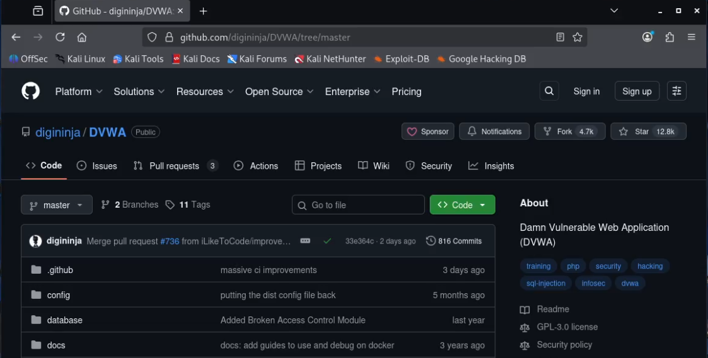{#fig:001 width=70%}

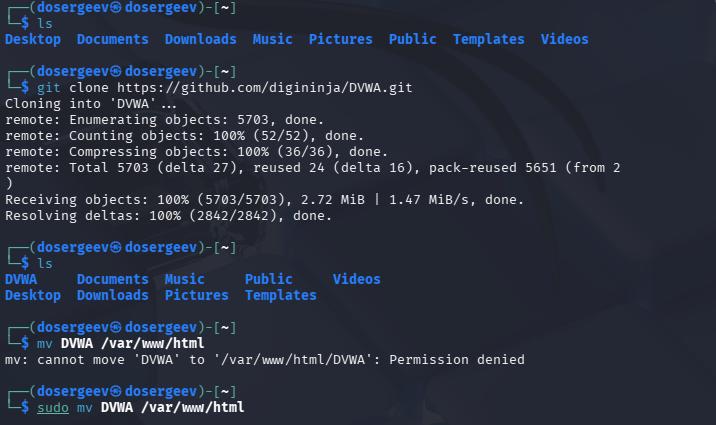{#fig:002 width=70%}

Запустим службу сервера apache2 и зайдем на сайт DVWA по ссылке `http://localhost/DVWA/`.

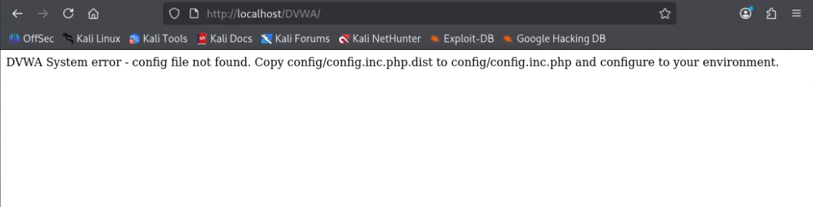{#fig:003 width=70%}

Выходит ошибка, так как мы не создали файл конфигурации DVWA. Для этого скопируем `config/config.inc.php.dist` в `config/config.inc.php` (каталог `config` находится по пути `/var/www/html/DVWA/config/`).

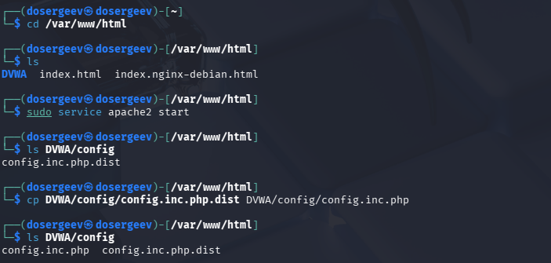{#fig:004 width=70%}

Попробуем снова зайти на сервер - теперь нас перекидывает на страницу `login.php`, но так как мы не подключили базу данных, выходит код ошибки 500.

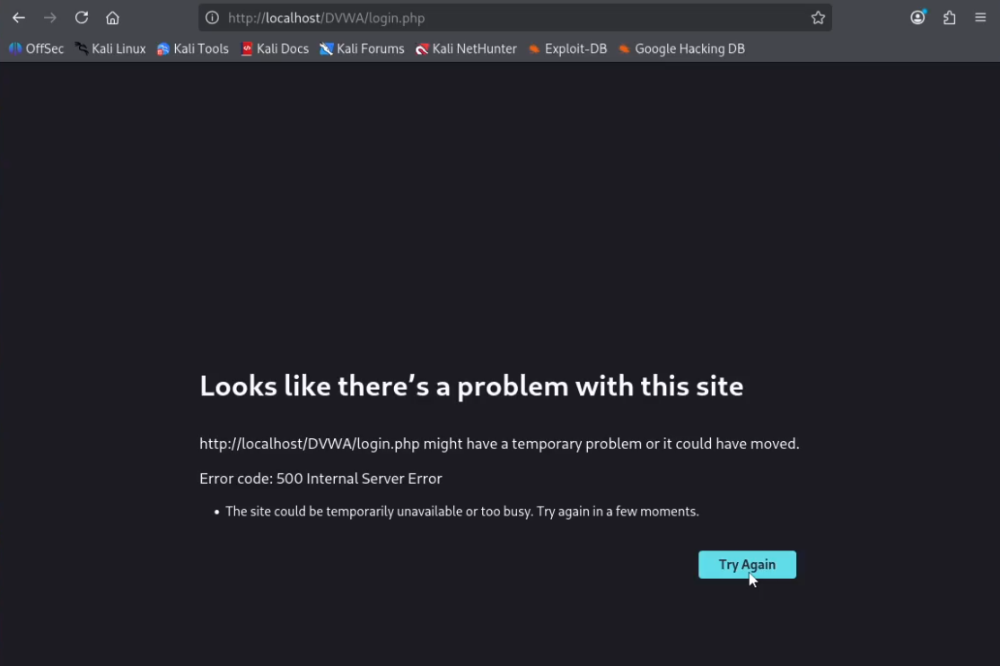{#fig:005 width=70%}

Перед тем, как создать базу данных, зайдем в файл `config.inc.php` и узнаем данные для базы данных. Запустим службу `mariadb` и откроем редактор.

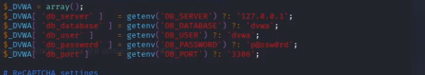{#fig:006 width=70%}

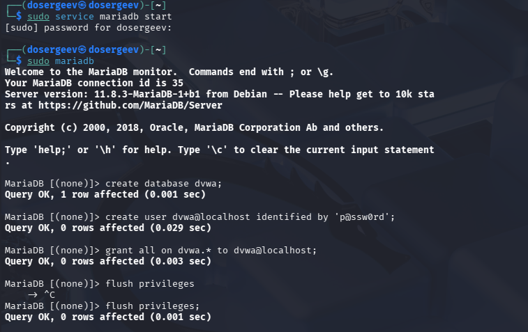{#fig:007 width=70%}

Зайдем на `http://localhost/DVWA/setup.php` и нажмем кнопку `Create / Reset Database`, после чего произойдет настройка базы данных.

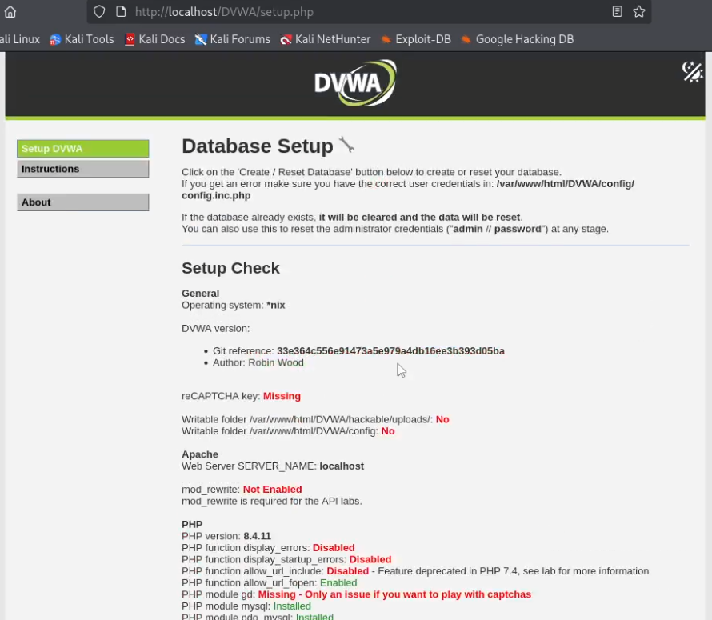{#fig:008 width=70%}

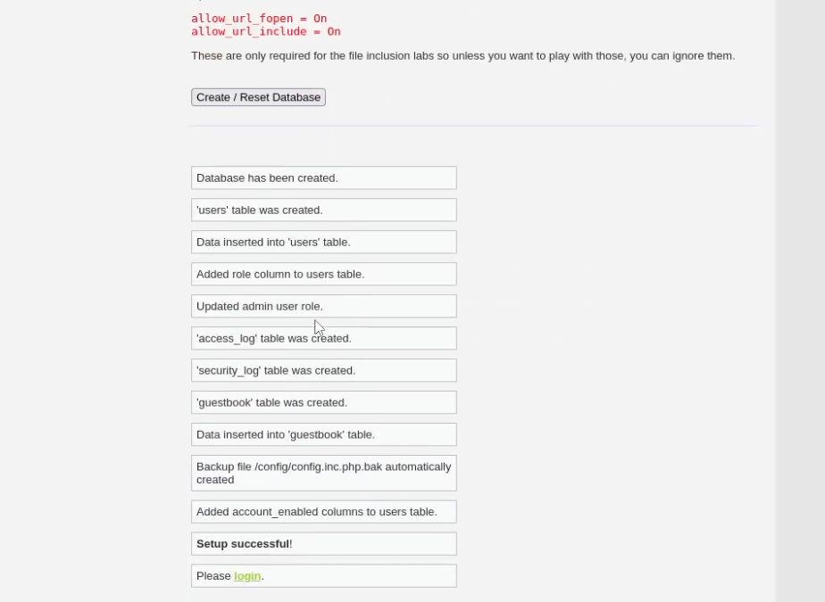{#fig:009 width=70%}

После настройки нас автоматически перекинет на страницу входа. Войдем в аккаунт, используя имя admin и пароль password.

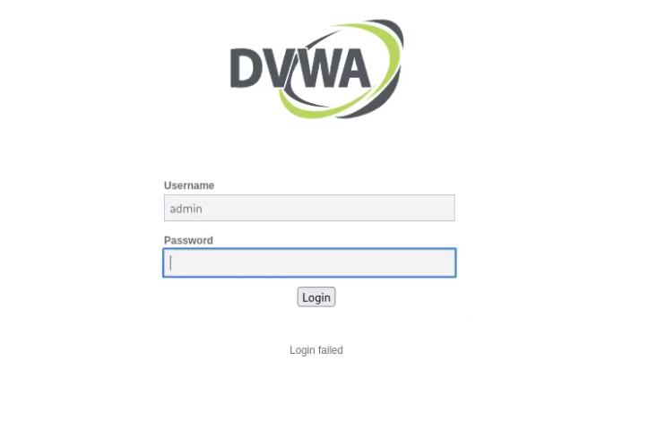{#fig:010 width=70%}

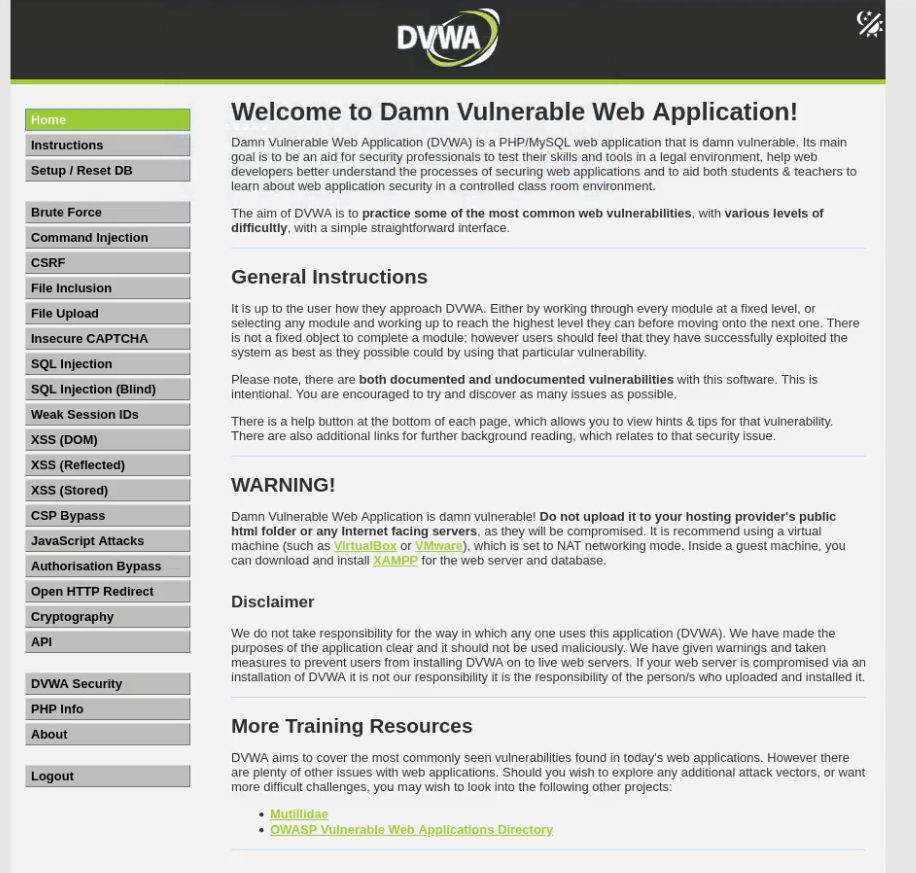{#fig:011 width=70%}

Последним шагом в конфигурации php включим отображение `display_errors` и `display_startup_errors`. Перезагрузим службу apache2.
```bash
sudo vi /etc/php/8.4/apache2/php.ini
sudo service apache2 restart
```

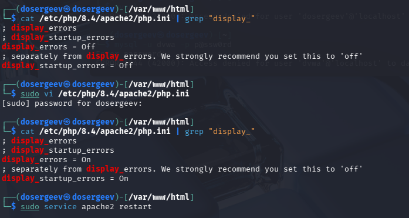{#fig:012 width=70%}

# Вывод

В результате выполнения лабораторной работы я установил Damn Vulnerable Web Application (DVWA) в гостевую систему Kali Linux и настроил его базу данных вместе с базовым функционалом.

# Список литературы{.unnumbered}

::: {#refs}
:::
