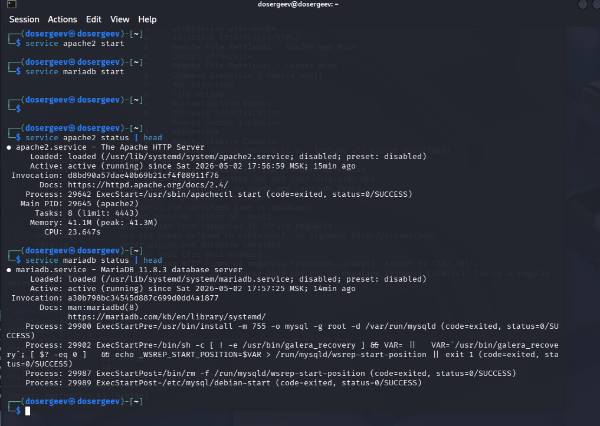
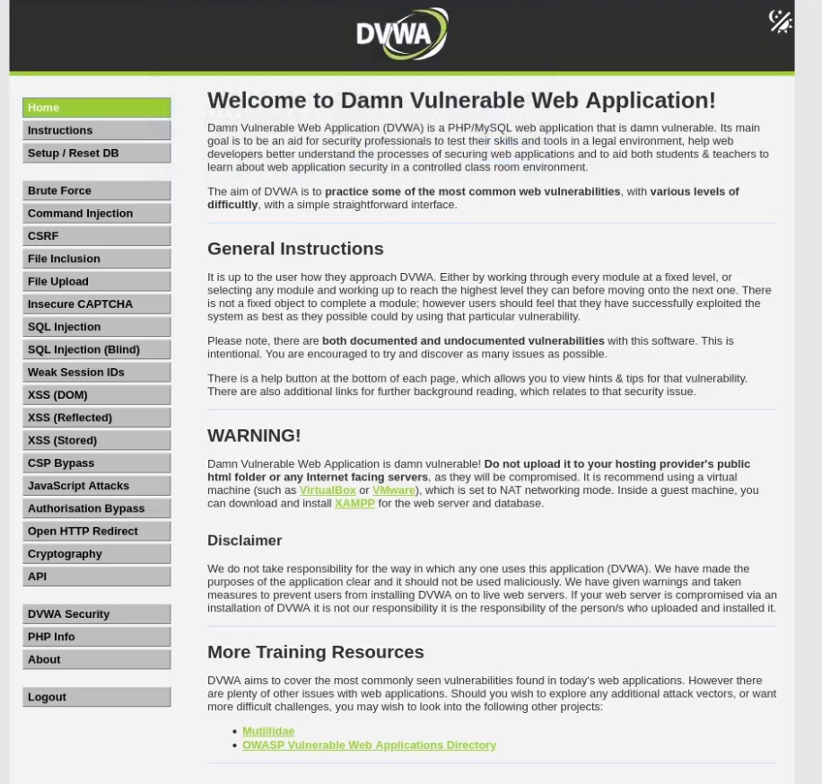
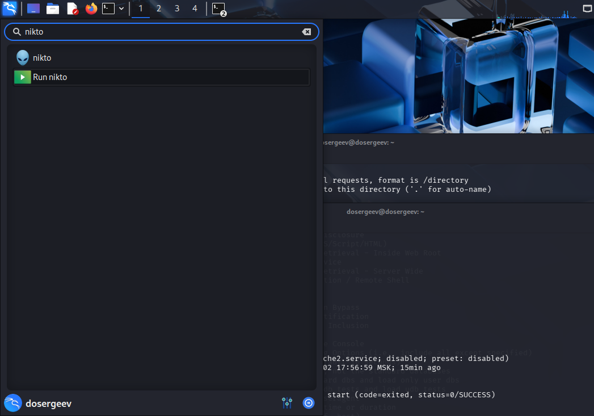
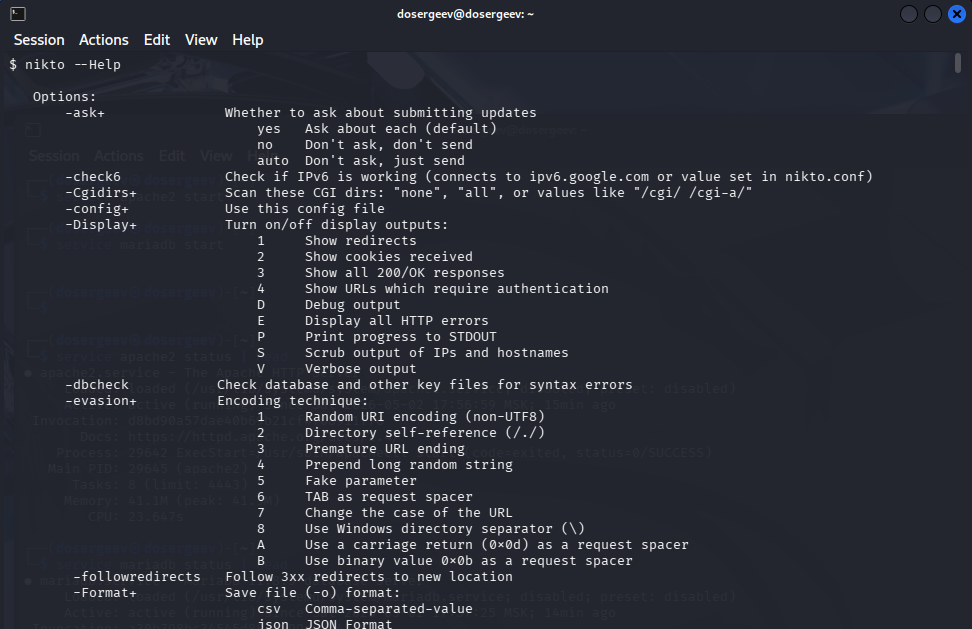
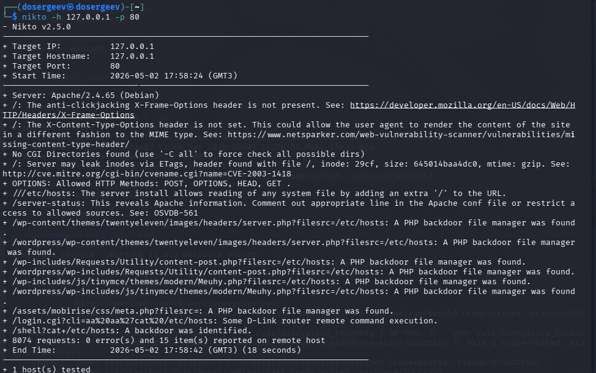

---
## Author
author:
  name: Сергеев Даниил Олегович
  degrees: DSc
  orcid: 0000-0002-0877-7063
  email: 1132246837@rudn.ru
  affiliation:
    - name: Российский университет дружбы народов
      country: Российская Федерация
      postal-code: 117198
      city: Москва
      address: ул. Миклухо-Маклая, д. 6
## Title
title: Индивидуальный проект
subtitle: Этап №4
license: CC BY
date: today
date-format: "YYYY-MM-DD" # Example: 2025-09-06
---

# Информация

## Докладчик

:::::::::::::: {.columns align=center}
::: {.column width="70%"}

  * Сергеев Даниил Олегович
  * Студент
  * Направление: Прикладная информатика
  * Российский университет дружбы народов
  * [1132246837@pfur.ru](mailto:1132246837@pfur.ru)
  * <https://github.com/FrigatZero>

:::
::::::::::::::

# Цель работы

Целью данной работы является использование базового сканера безопасности веб-сервера nikto в рамках индивидуального проекта.

# Ход выполнения лабораторной работы

## Запуск DVWA

Будем тестировать nikto на основе DVWA, установленного на прошлых этапах. Откроем терминал от имени администратора и запустим службы `apache2` и `mariadb`.
```bash
service apache2 start
service mariadb start
service apache2 status | head
service mariadb status | head
```

## Запуск DVWA

{#fig:001 width=70%}

## Запуск DVWA

{#fig:002 width=70%}

## Использование nikto

nikto - базовый сканер безопасности веб-сервера Он сканирует и обнаруживает уязвимости в веб-приложениях, обычно вызванные неправильной конфигурацией на самом сервере, файлами, установленными по умолчанию, и небезопасными файлами, а также устаревшими серверными приложениями.

Запустим сканер из поискового меню. Откроется терминал со справкой к возможным опциям nikto.

## Использование nikto

{#fig:003 width=70%}

## Использование nikto

{#fig:004 width=70%}

Так как Apache запущен локально, укажем loopback адрес и порт 80 (стандартный для http).
```bash
nikto -h 127.0.0.1 -p 80
```

## Использование nikto

{#fig:005 width=70%}

## Использование nikto

Программа запустит анализ и выведет сводку для каждой уязвимости, которую найдет. Nikto нашел следующие уязвимости:

- Отсутствует заголовок `X-Frame-Options`, что делает сайт уязвимым к атакам clickjacking.
- Не установлен заголовок `X-Content-Type-Options`, что может позволить браузеру интерпретировать контент неверного MIME-типа.
- Сервер Apache раскрывает inode через заголовок ETag, что может привести к утечке информации.
- Достыпные HTTP-методы: POST, OPTIONS, HEAD и GET.

## Использование nikto

- Обнаружена возможность чтения системных файлов через добавление лишнего слеша в URL (например, `//etc/hosts`).
- Страница `/server-status` раскрывает информацию о сервере Apache.
- По пути многих адресов найден PHP-бэкдор-файловый менеджер.
- Скрипт `login.cgi` с параметром `cli=aa%20aa%27cat%20/etc/hosts` указывает на возможность удалённого выполнения команд на некоторых роутерах D-Link.
- Обнаружен бэкдор через URL `/shell?cat=/etc/hosts`.

# Вывод

В результате выполнения лабораторной работы был испытан базовый сканер безопасности веб-сервера nikto на основе уязвимого DVWA. Были исследованы возможные уязвимости, которые нашлись внутри данного веб-приложения.
