---
## Author
author:
  name: Сергеев Даниил Олегович
  degrees: DSc
  orcid: 0000-0002-0877-7063
  email: 1132246837@rudn.ru
  affiliation:
    - name: Российский университет дружбы народов
      country: Российская Федерация
      postal-code: 117198
      city: Москва
      address: ул. Миклухо-Маклая, д. 6
## Title
title: Индивидуальный проект
subtitle: Этап №5
license: CC BY
date: today
date-format: "YYYY-MM-DD" # Example: 2025-09-06
---

# Информация

## Докладчик

:::::::::::::: {.columns align=center}
::: {.column width="70%"}

  * Сергеев Даниил Олегович
  * Студент
  * Направление: Прикладная информатика
  * Российский университет дружбы народов
  * [1132246837@pfur.ru](mailto:1132246837@pfur.ru)
  * <https://github.com/FrigatZero>

:::
::::::::::::::

# Цель работы

Целью данной работы является использование приложения BurpSuite в рамках индивидуального проекта.

# Ход выполнения лабораторной работы

Будем тестировать BurpSuite на основе DVWA, установленного на прошлых этапах. Запустим веб-приложение и BurpSuite.
```bash
service apache2 start
service mariadb start
```

Burp Suite представляет собой набор мощных инструментов безопасности веб-приложений, которые демонстрируют реальные возможности злоумышленника, проникающего в веб-приложения.

## Ход выполнения лабораторной работы

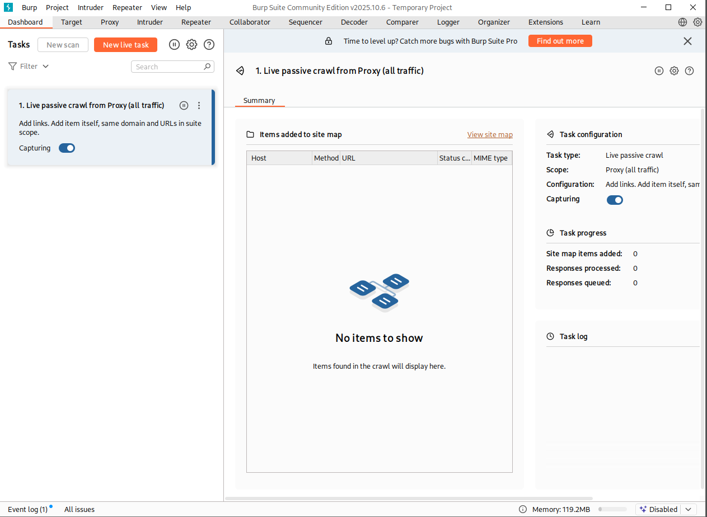{#fig:001 width=70%}

## Ход выполнения лабораторной работы

Откроем вкладку Proxy и включим перехват запросов (Intercept on) и откроем браузер через приложение (если открыть браузер через BurpSuite, то он автоматически настроит подключение к прокси-серверу). Попробуем посетить целевой сайт `localhost/DVWA`. Если мы будем просто ждать, то страница не загрузится, из-за того, что BurpSuite перехватил запрос. Откроем Proxy и посмотрим, приложение определило.

## Ход выполнения лабораторной работы

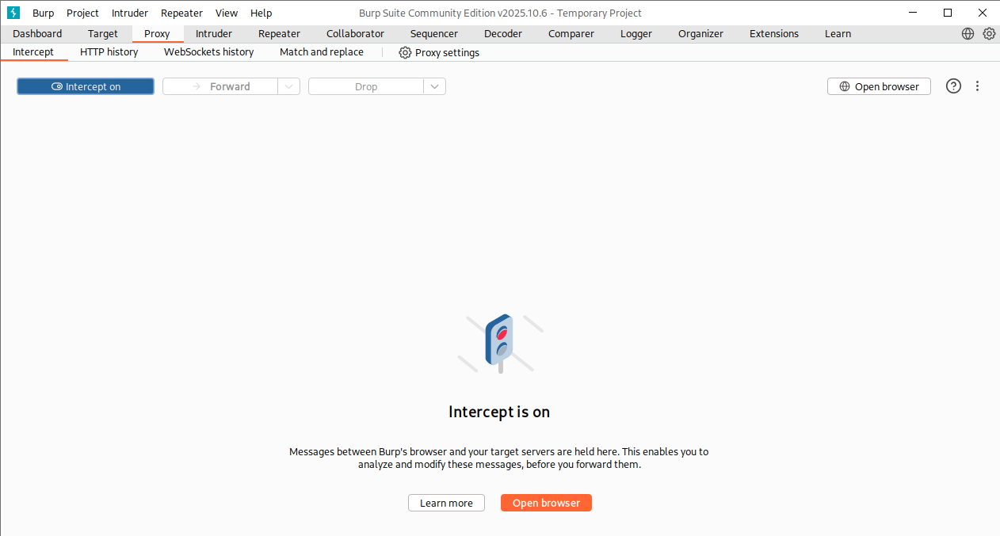{#fig:002 width=70%}

## Ход выполнения лабораторной работы

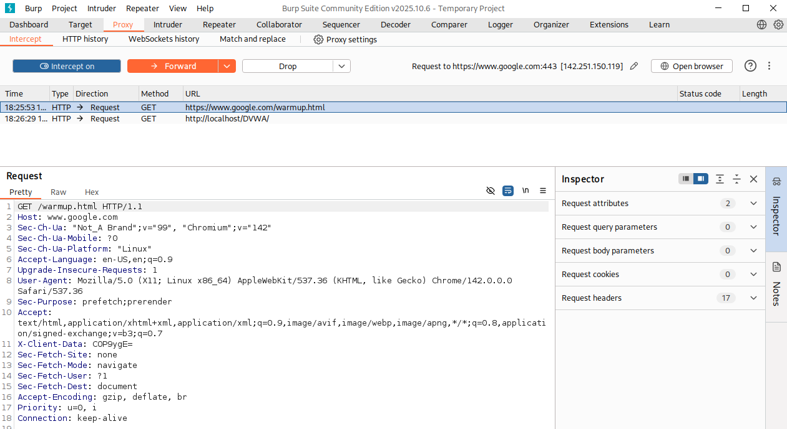{#fig:003 width=70%}

## Ход выполнения лабораторной работы

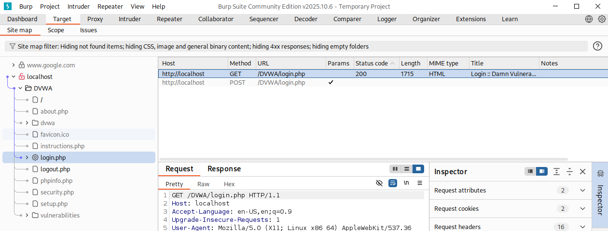{#fig:004 width=70%}

Вернемся на страницу и попробуем сгенерировать трафик, которым воспользуется нарушитель в лице BurpSuite. Заполним в форме входа случайные данные и отправим POST запрос.

## Ход выполнения лабораторной работы

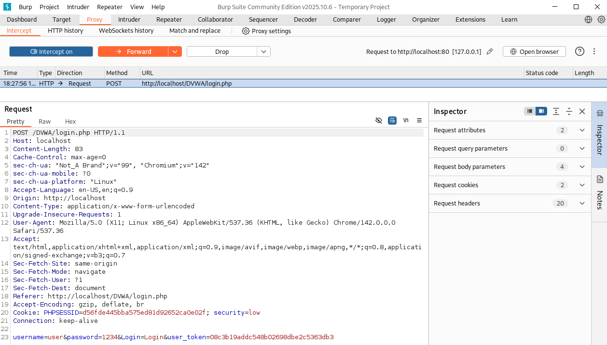{#fig:005 width=70%}

## Ход выполнения лабораторной работы

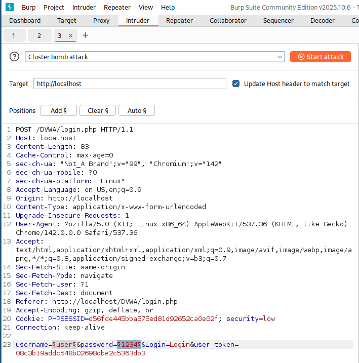{#fig:006 width=50%}

## Ход выполнения лабораторной работы

Теперь в меню полезных нагрузок Payloads укажем данные для перебора, а именно: имя пользователя (1) и пароль (2).

:::::::::::::: {.columns align=center}
::: {.column width="50%"}

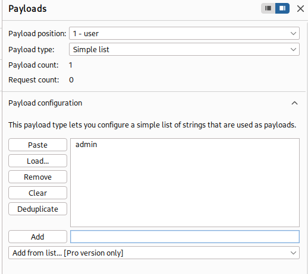{#fig:007 width=70%}

:::
::: {.column width="50%"}

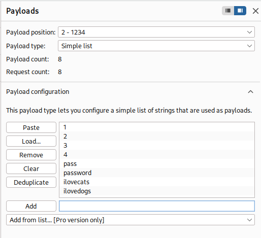{#fig:008 width=70%}

:::
::::::::::::::

## Ход выполнения лабораторной работы

Запустим атаку и посмотрим результаты перебора. Мы можем заметить, что все запросы имеют статус 302 - перенаправление. При неудачной попытке, страница перекидывает нас на форму входа `login.php`, а при удачной - на страницу `index.php`.

## Ход выполнения лабораторной работы

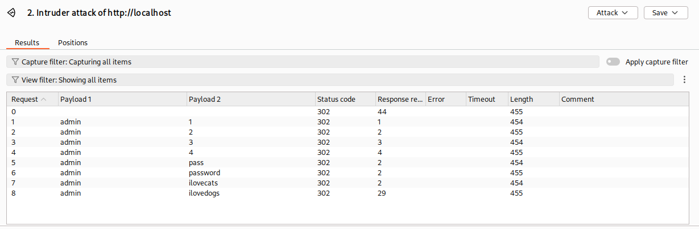{#fig:009 width=70%}

## Ход выполнения лабораторной работы

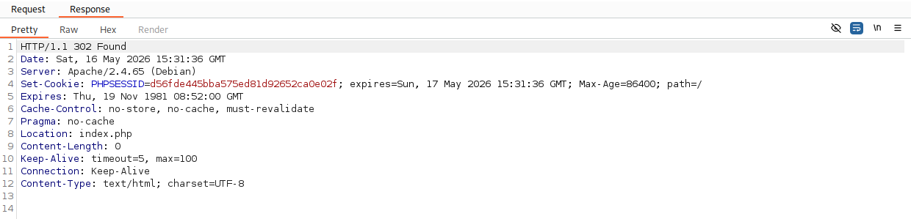{#fig:010 width=70%}

## Ход выполнения лабораторной работы

Передадим тело POST запроса в Repeater. Здесь мы можем поменять пароль и имя пользователя на правильные и совершить редирект. После этого мы получим ответ в поле Response. Там же мы можем предварительно посмотреть на то, как будет выглядить страница.

## Ход выполнения лабораторной работы

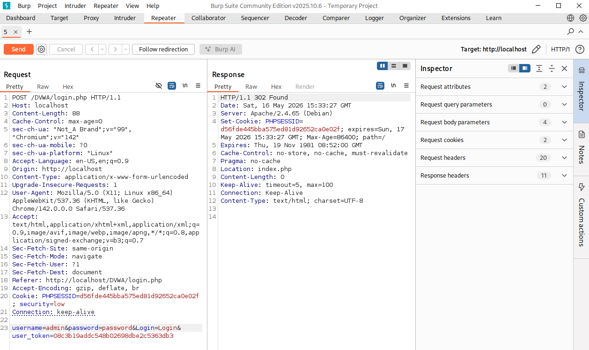{#fig:011 width=70%}

## Ход выполнения лабораторной работы

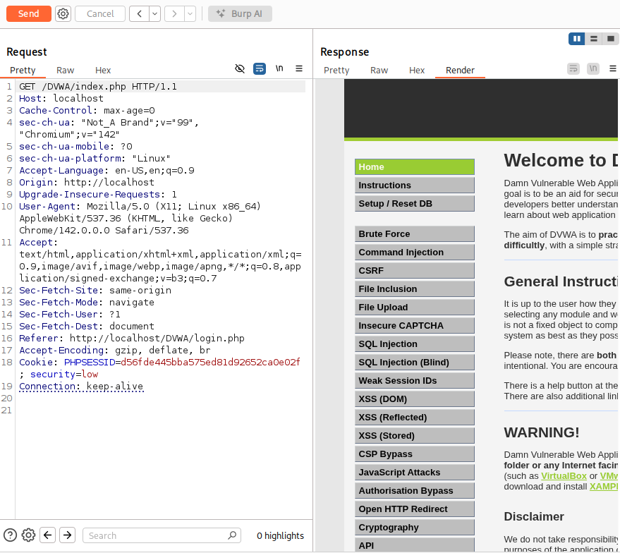{#fig:012 width=70%}

# Выводы

В результате выполнения лабораторной работы я испытал набор инструментов безопасности веб-приложений BurpSuite и узнал как с помощью него можно совершить атаку Cluster bomb на незащищенный сайт.

